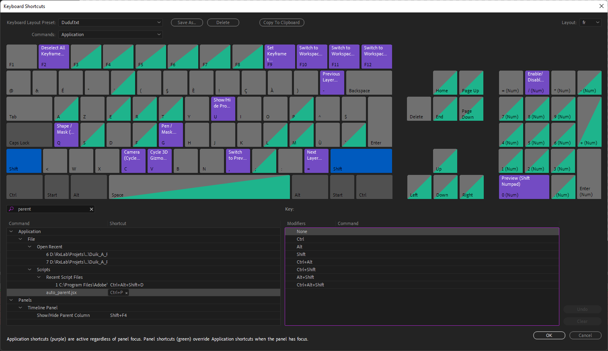

# Add keyboard shortcuts to Duik functions

Using the API, you can quickly write just a few lines to create [*headless scripts*](headless-scripts.md). These scripts can then easily be assigned keyboard shortcuts in *After Effects*.

Let's use this script as an example:

```js
(function(){
    #include "DuAEF_Duik_api.jsxinc"
    DuAEF.init( "Auto-Parent", "1.0.0", "RxLaboratory" );
    DuAEF.enterRunTime();

    // Run the Auto-Parent method
    // See: http://duik.rxlab.io/Duik.Constraint.html#.autoParent
    Duik.Constraint.autoParent();
})();
```

Just save it in a file called `Auto-Parent.jsx` for example.

## Save the script in After Effects

First, we need to save the script where After Effects will find it.

Copy the `Auto-Parent.jsx` file to:

- Windows: `C:\Program Files\Adobe\Adobe After Effects XXXX\Support Files\Scripts\`
- Mac: `/Applications/Adobe After Effects XXXX/Scripts/`

As the script uses the Duik API, the API needs to be copied in the same folder. Copy `DuAEF_Duik_api.jsxinc` in the same folder[^1].

## Assign the shortcut

Restart After Effects if it was open, and go to `Edit ► Keyboard Shortcuts`



To assign `[Ctrl] + [P]` to the script (for example), first click on the `P` key on the keyboard image, to check what's already assigned to it and make sure you want to replace the default.

Then type the name of the script in the search field to locate it, and just click on the empty space next to it, in the column labelled *Shortcut". The, just type your shortcut, et voilà !

[^1]:
    Once you've copied the API in the folder, you can add as many scripts using it as you wish, they will all share the same file. Be careful though, if different scripts need different versions of the API, you may have to rename the API file to store the different versions in the same folder, and update the `#include` line accordingly.