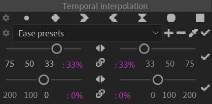
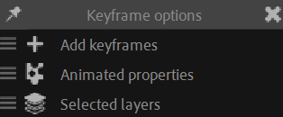
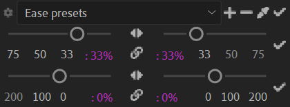

# Temporal Interpolation

The second part of the animation panel contains several temporal interpolation tools. It's where you can quickly add or edit keyframe types, and quickly set the *easing* values or even copy and paste them.

  
*Le praxinoscope à projection de M. Reynaud,  
La Nature, revue des sciences,  
Louis Poyet, 1882  
Public domain.*{style="font-size:0.8em;"}

## Add / Edit keyframes

The first line of the temporal interpolation section lets you very quickly create or edit keyframe types.

You can switch between the add or edit mode in the {style="width:1em;"} *options*.

### Edit keyframes

1. **Select** a bunch of keyframes.
2. **Click one of the buttons** to set the type of keyframe interpolation to the selection.

!!! note
    When setting a type with Bézier interpolation ({style="width:1em;"},  {style="width:1em;"} or {style="width:1em;"}), the keyframe ease uses the values of the sliders, and not the default After Effects values.

### Add keyframes

1. **Select** some properties
2. **Click one of the buttons** to add keyframes with the corresponding interpolation type.

By default, Duik adds keyframes on all **animated properties** it'll find, but you can set it to only add keyframes on explicitely **selected properties** if you prefer.

By default, Duik works only with **selected layers**, but you can tell it to use **all layers**; in this case it'll add keyframes in all properties of the composition, no matter the selection. Be careful, this may be a bit long if there are a lot of animated properties.

## Edit keyframe ease

The second part of the temporal interpolation section is a keyframe ease editor, used to quickly adjust te keyframe ease on selected keyframes very quickly.

In After Effects, the keyframe ease, which actually controls the Bézier interpolation between keyframes, consists in two values:

- The **influence** controls what would be the length of the tangent of the Bézier curve in the graph editor; for horizontal tangents (i.e. with `0` velocity), it directly controls the acceleration (ease out) and deceleration (ease in) of the motion around the keyframe.
- The **velocity** is a signed value controlling the speed of the motion before (ease in) and after (ease out) the keyframe; the sign of the value tells the direction of the movement. In the graph editor, it is the angle of the tangents controling the Bézier curve.

The first line with the dropdown menu let's you quickly apply, add or remove easing presets.

Below are two groups of two sliders.

The first group sets the influence, the second group sets the velocity.

The sliders on the left-hand side set the *ease in* (before the keyframe), the sliders on the right-hand side set the *ease out* (after the keyframe)[^inandout].

The three {style="width:1em;"} ***apply*** buttons set the easing values to the selected keyframes; the first one sets both the influence and velocity, while the two others can be used to set only the influence or only the velocity.

!!! tip
    Actually, you don't really need the {style="width:1em;"} ***apply*** buttons, except to apply already existing values to other keyframes: as soon as you edit the value of one of the sliders, it's automatically applied on the selected keyframes.

### Velocities

In After Effects, velocities are an absolute value, which depends on the property where it is used. In can be in *pixels per second* for spatial properties, or in *degrees per second* for angles, etc.

Duik uses a value relative to the velocity of a linear interpolation, given in percent, which is automatically converted to and from After Effects absolute velocities. This allows to copy and set the interpolation from any keyframe to any other keyframe on any property.

With this system:

- `0 %` velocity means no velocity.
- `100 %` is the equivalent of the *continuous* mode of After Effects:  
    It's the velocity of a linear interpolation.
- `-100  %` is the same as above but going in the other direction.

### Copy and paste keyframe ease values

1. **Select** a keyframe.
2. Click the {style="width:1em;"} ***pick***  button.  
    The influence and velocity values are set on the sliders.
3. **Select** the destination keyframes.
4. Click one of the {style="width:1em;"} ***apply*** buttons.

### Presets

1. **Select** some keyframes
2. **Select the preset** in the dropdown menu  
    The preset values are automatically set on the sliders below
3. You can further apply these values with the {style="width:1em;"} ***apply*** buttons.

To add a preset, set the values you need with the four sliders then click the {style="width:1em;"} ***add*** button.

To remove a preset, select it in the list and click the {style="width:1em;"} ***remove*** button.

[^inandout]: To the contrary of other animation software, in After Effects the interpolation is set on a single keyframe, around it, and "*in*" means *arriving in the keyframe*, *before* it, "*out*" means *getting out of the keyframe*, *after* it. That's what's called the *keyframe ease*.  
In other animation software, the interpolation is defined between two keyframes (which is more logical and makes more sense mathematically speaking: there can't be any interpolation for a single keyframe, one always needs *at least two* keyframes to interpolate).  
In this latter case, "*in*" means *getting in the interpolation*, that is *after* the first keyframe, what After Effects would call "*ease out*", and "*out*" is the opposite, what After Effects would call "*ease in*". ¯\\_(ツ)_/¯
