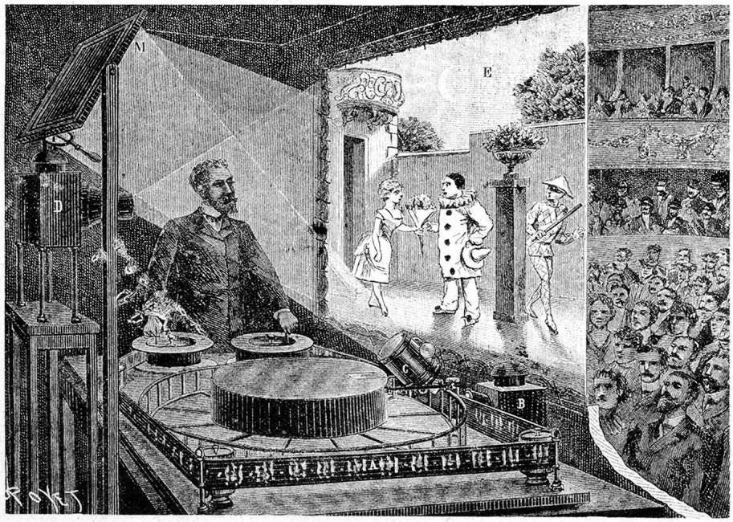
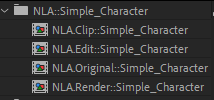
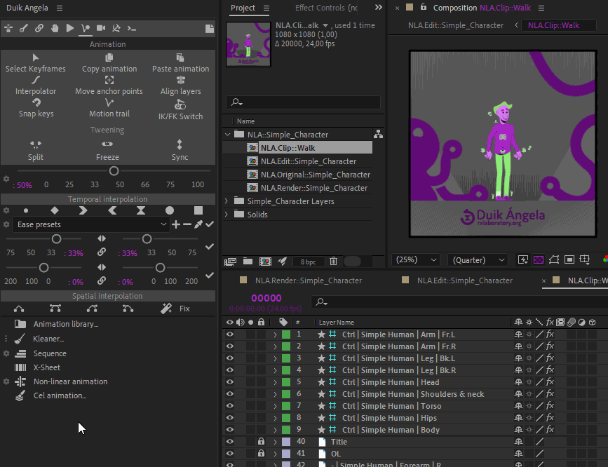
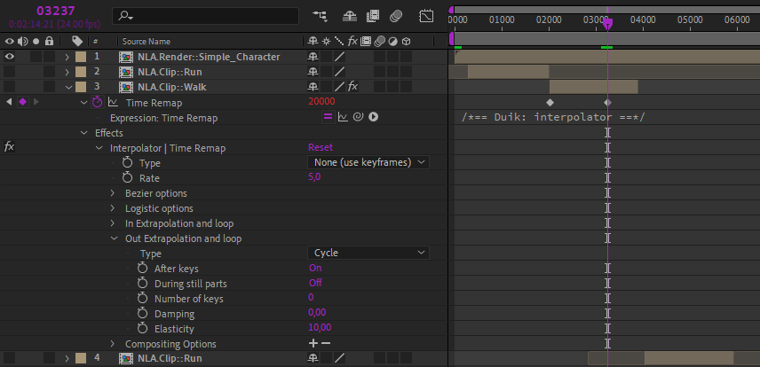

#  Non-Linear Animation

Using the *Non-Linear Animation* tool, abbreviated as ***NLA***, you can edit animation clips the same way you would edit video clips in a non-linear editing software (*NLE*) like *Adobe Premiere* or *Avid Media Composer* for example, but right into *After Effects*, keeping all your animation editable at any time.

  
*First public performance of Reynaud's 'Theatre Optique' in Paris,  
Louis Poyet, 1892  
Public domain.*{style="font-size:0.8em;"}

Not only the *NLA* can edit your animations together, but it also can actually *transition* between animations as simply as a crossfade effect, by animating simple opacity values.

  
*This video is part of [__the official comprehensive video course about Duik Ángela__](https://rxlaboratory.org/product/the-official-comprehensive-video-course-about-duik-angela/)*

## Usage

To use the *NLA*, you need to start from a base composition, containing what you wish to animate, which can be anything: simple layers, rigged character, props, using or not using Duik [*Controllers*](../controllers/index.md).

  
*This video is part of [__the official comprehensive video course about Duik Ángela__](https://rxlaboratory.org/product/the-official-comprehensive-video-course-about-duik-angela/)*

### Creation

Like other tools in Duik, **you first have to select what you're rigging/animating** and then click on the *Non-linear Animation* button. Depending on the selection, this is how Duik will create and rig the *NLA* using the active composition:

1. If Duik finds any **selected properties**, it will rig them, and only them.
2. Else, if Duik finds any **selected layers**, it will rig **all transform properties** (position, rotation, scale, opacity) of these layers, plus the **effects** if the layer is a Duik [**Controller**](../controllers/index.md).
3. Else, Duik will rig **all transform properties and effects** of all Duik [**Controllers**](../controllers/index.md), if any.
4. Finally, if Duik did not find anything else, it will rig all transform properties of **all layers**.

!!! note
    The current values (e.g. the current pose of the character) will be the "neutral" values, the "rest" pose. They are the values from which the animation will be generated, and to which the *NLA* will fall back if there's no animation.

Duik then creates a few ***NLA Compositions***.

  
*By default, without selection, the *NLA* rigs all transform properties of the Duik controller layers.*

From a single base composition:

the *NLA* creates a folder containing four new compositions:

These compositions are:

- ***NLA.Clip::**name*: **Clips** are the compositions containing the actual animated clips; they're where you animate the layers, using either keyframes or expressions. There can be as many *NLA.Clip* compositions as you need. You can quickly create new clips from the *NLA* options in the Duik Animation panel.
- ***NLA.Edit::**name*: **Edit** is the composition where you can edit your animated clips together.
- ***NLA.Original::**name* is a copy of the original composition. It is used to create new clips.
- ***NLA.Render::**name* is the composition containing the result of the edit, i.e. the clips edited together with their transitions. It is the composition which may be rendered or used as a precompositions in other parts of the project.

!!! warning
    Do not change the first part of the name of these compositions (before and including `::`) as it is used by Duik and the *NLA* expressions to identify these compositions. The rest, the end of the name, can be safely modified at any time.

### Animated clips (*NLA.Clip::*)

The actual animations are made in the ***NLA.Clip::*** compositions. Open these compositions and animate your layers as you would in any other composition. You can use either keyframes, expressions or any Duik feature, the *NLA* will work with all animated values no matter how they're controlled.

To **create new clips**, you can either **duplicate an existing clip** (to work from the existing animation) or use the __*Add new clip* button__ in the *NLA* options in the Duik Animation panel. This button will create a new clip for the *NLA* corresponding to the active composition (it doesn't matter which one it is as long as it belongs the the *NLA*, i.e. its name starts with "*NLA.*").

You can - and it is recommended to - change the duration of the "*NLA.Clip::*" compositions, so they fit the exact duration of the animation.

### Edit clips together

To edit the clips together and benefit from the powerful *NLA* features, open the ***NLA.Edit::*** composition.

From this comp, you can edit the clips together as you would with video clips in a video editing software. You can **trim**, **move**, **duplicate** the clips.

To work with the edit:

- The ***NLA.Clip::*** precompositions must be hidden. They're used by the *NLA* to generate the animation, but they're not actually used for rendering.
- The result is rendered in the ***NLA.Render::*** composition. That's the reason why you should keep it enabled as the first layer of the ***NLA.Edit::*** composition; this is the way to see the result of the edit, in real time.
- At times when there are no clips in the timeline (or if all their opacity is at `0 %`), the *NLA* falls back to the original values as they were before the creation of the *NLA*.

### Adding other properties to the NLA

According to the way you've setup the *NLA*, you may want to add other properties to be animated and rigged by the *NLA*. There are two simple ways to do that:

First, **open** the ***NLA.Render::*** composition. Then, you can either:

- Copy and paste the *NLA* expression from any property to the property you wish to add.
- Or select the new properties, and click on the *Non-Linear animation* button in the Animation Panel of Duik.

### Looping animation and time remapping

**You can use and modify the time remap property** of the ***NLA.Clip::*** precompositions in the ***NLA.Edit::*** composition. This is a nice and easy way to change the speed of the animation, or to loop them, either using time remap keyframes, expressions or the Duik [***Looper***](../automation/looper.md) feature.

### Transition between animation

**Animations can be controlled using the opacity** of the the ***NLA.Clip::*** precompositions. `100 %` plays the animation as it is, `0 %` deactivates it, and values in between multiply the values, effectively *weighting* the animations. This can especially be used to **animate transitions between clips**, for example to transition between a standing pose and a walk cycle, and then from a walk cycle to a run cycle. This works exactly as if you were animating a crossfade between video clips, except that the *NLA* doesn't actually animates the opacity but really animates the transition of all animated properties between the animated clips.

!!! tip
    An ***NLA::Weight*** slider is also added in the effects of the *NLA.Clip::* precompositions, which controls the weight the same way as the opacity of the layer, except that it's not limited to the range `[0 %, 100 %]`. You can use this slider instead of the opacity if you wish to *extrapolate* the animation.

### Use or render the result

You can use either the *NLA.Edit::* or the ***NLA.Render::*** compositions to include the edited animation inside other compositions or to render it.

