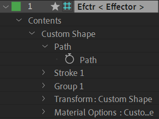

# {style="width:1em;"} Effector

The spatial effector is an easy way to control (lots of) properties according to the location of a layer, or, more precisely, to the area defined by a shape of any kind and its exact location.

  
*This video is part of [__the official comprehensive video course about Duik Ángela__](https://rxlaboratory.org/product/the-official-comprehensive-video-course-about-duik-angela/)*

1. **Animate the slave properties** as they should change with the effector.
2. **Select the slave properties** to be controlled with the spatial effector.
3. Click the {style="width:1em;"} ***Effector*** button.

  
*An effector controlling layer colors and rotation.*

The effector is a simple shape layer Duik creates in the composition; you can move it around or parent it to another layer, the absolute position of the effector layer (and its shape) controls the slave properties.

!!! tip
    You can translate but also rotate and scale the effector.

You can tweak the effector with the effect on the layer.

The slave property values will change according to the location of the anchor point their layer relative to the effector's shape, transitionning between the limits.

- The ***Inner limit*** is shown in green on the effector layer.
- The ***Outer limit*** is shown in red.
- The ***Mode*** changes the shape of the effector, it can be a **circle**, an **infinite line**, or a **custom shape**.
- Use the ***Interpolation*** section to change the way the value transition between the limits of the effector.

When using a *custom shape*, you can change the shape by modifying the corresponding Bézier path in the content of the shape layer.

  
*The path property to edit to adjust the custom shape of the effector.*

