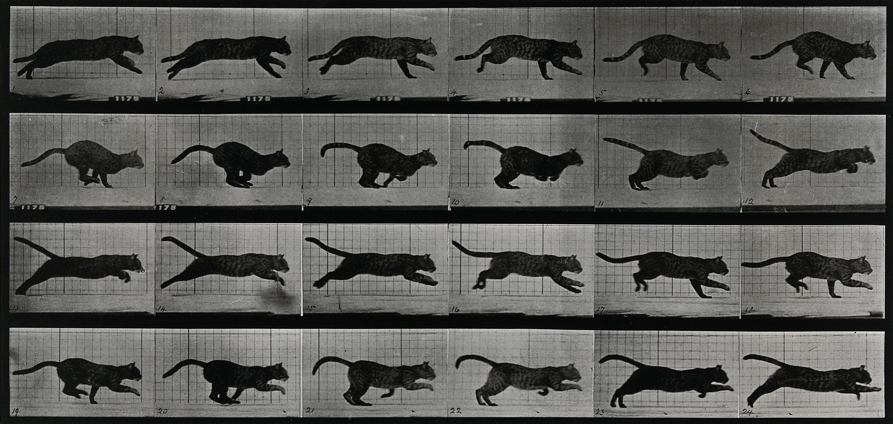
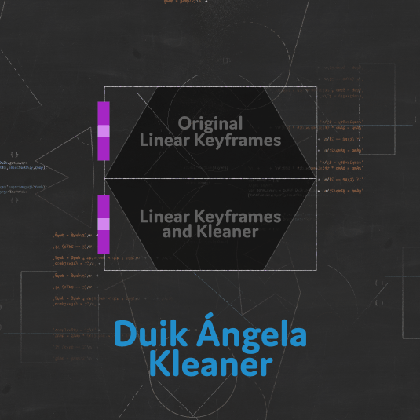
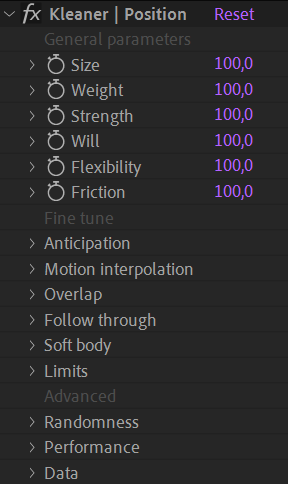
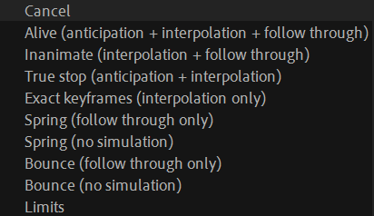
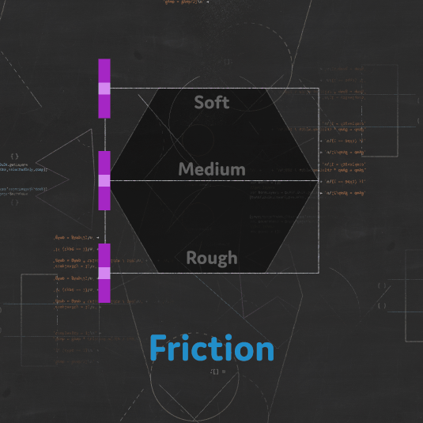

# {style="width:1em;"} Kleaner

*Kleaner* stands for ***Keyframe Cleaner***[^pun]. It's a very poowerful tool to help you achieve the best animation with very little work; for any simple enough animation, it's able to do all the tedious interpolation[*](../../misc/glossary.md) and some extrapolation[*](../../misc/glossary.md) work for you, adding all the details needed in the animation using only simple linear keyframes.

{style="max-height:720px"}  
*A cat running,  
Eadweard Muybridge, 1887   
Public domain.*{style="font-size:0.8em;"}

It's a smart tool which takes a lot of parameters into account to generate the best animation. To achieve this result, we've used advanced coding techniques, like *Fuzzy Logics*[^fuzzy]; everything uses **analytical methods** though, there's **no simulation nor A.I.** or machine learning: this is **a tool for animators made by animators**. It's not physically accurate; **every generated motion has been designed** and fine tuned to be the best according to the animator's view, not to mimic perfectly the real world. Like any true animation.

!!! note
    The term *simulation* is actually used in the Kleaner properties and this document, but it really refers to a *fake* simulation, tweaked to generate a better animation and not physically accurate nor using any actual physical law or formula.

The *Kleaner* has a lot of options though, so that you can still have a fine control on your animation, or even manually adjust each and every little part, while still working quickly on the whole animation at once by just setting some general parameters.

  
*A simple animation curve generated by the Kleaner from two linear keyframes*

  
*An animation curve generated by the Kleaner from three linear keyframes*

  
*An animation curve generated by the Kleaner from three linear keyframes*

As you can see, the Kleaner adapts the generated animation to any keyframe available, which makes it easy to tweak the animation by just using a few linear keyframes.

You can use the Kleaner with any property which can have expressions.

1. **Select** the properties.
2. Click the ***{style="width:1em;"} Kleaner*** button.
3. **Choose** one of the presets.

You can adjust the settings and tweak the Kleaner with the effect Duik adds to the layer.

To make it easier to use and discover, the settings are divided in three parts:

- Some **general properties** describing the object being animated, like its weight and initial energy, or will, etc.
- **Detailed parameters** for all animation principles applied by the Kleaner, to let you go into small details if you wish, or customize the animation further.
- **Advanced settings** to control low-level parameters of the Kleaner.

## Presets

When you click the ***{style="width:1em;"} Kleaner*** button, you have to choose one of these settings:

- **Alive** (anticipation + interpolation + follow through)  
    Use this preset with any character (or object, or part of a charactert) which moves voluntarily (i.e. the movement doesn't have an external cause, like gravity or a hit).  
    With this preset, the Kleaner applies an anticipation[*](../../misc/glossary.md) to the movement, then interpolates accordingly to the general parameters you'll choose, and ends the movement with a follow through[*](../../misc/glossary.md) animation. It also adds overlap[*](../../misc/glossary.md) and drag[*](../../misc/glossary.md) to spatial properties.
- **Inanimate** (interpolation  + follow through)  
    This is almost the same as the *Alive* preset, except the anticipation is disabled[^anticipate].
- **True stop** (anticipation + interpolation) 
    This is the same preset as the *Alive* preset, except there's no follow through at the end of the animation, to let you manually animate it.
- **Exact keyframes** (interpolation only)  
    With this preset, the Kleaner only interpolates between the keyframes, without anticipation nor follow through animation. With this setup, the resulting animation actually goes through the exact values of the keyframes, which may not be the case with the previous presets.
- **Spring** (follow through only)  
    Use this preset if you want to animate manually, but have an automatic follow through at the end of the animation. The Kleaner also adds some overlapping and dragging animation on spatial properties.
- **Spring** (no simulation)
    This is the same preset as the previous one, except all simulations are disabled. This improves the performance a lot, but there won't be any overlapping and dragging animation on spatial properties anymore.
- **Bounce**  (follow through only)  
    This is the same as the *Spring* preset, but for objects bouncing on a surface instead of turning around the end value.
- **Bounce**  (no simulation)  
    This is the same as the *Spring* preset, but for objects bouncing on a surface instead of turning around the end value.
- **Limits**  
    Use this preset if all you need is to bound the values of the property inside some predefined (but animatable) limits.

## General parameters

You can use these general parameters to set the main properties of the object being animated.

These are arbitrary, unitless values; if you *feel* the object is not heavy enough, raise a bit its *Weight*, that's all.

!!! note
    Duik and the Kleaner can do much for you. But **it can't move keyframes and change the duration of the animation**! If even with these settings your animation is too fast or the object feels too light, it may be because you need to adjust the timing[*](../../misc/glossary.md) of the animation, move the keyframes and make it longer, and vice versa.

    Before applying the Kleaner, try to time the animation the best you can (it's easier with the default easy-ease interpolation than linear keyframes, select the keyframes and hit `F9`).

Once you've set these values as best as you can, you can further improve and customize the animation by adjusting the fine tuning parameters.

## Fine Tune

{style="max-height:720px"}  
*A galloping horse and rider,  
Eadweard Muybridge, 1887   
Public domain.*{style="font-size:0.8em;"}

The Kleaner does a lot of things for you, effectively applying some general animation principles. What it does exactly also depends on the type of property being animated.

- ***Anticipation*** is what happens before the actual movement, to get momentum before moving the object. It's one of the 12 Disney's animation principles[^principles]. The *Will* is shown with the anticipation.
- The ***Motion Interpolation*** is what happens between the keyframes, it describes how the Kleaner *smoothes* the animation and makes it more dynamic. It's mostly with this interpolation that the *Weight* of the object is shown, and the *Will* of the character, but almost all other general parameters are also used to tweak it.
- The ***Overlap***, or *drag*, is what makes objects *lag behind* their parents, the other objects they're attached to. The Kleaner is able to add overlapping animation and drag to **spatial properties**.
- The ***Follow through*** is what happens after the keyframes and the main animation. It is how the object oscillates or bounces on a surface before coming to a full stop.
- Duik is able to simulate ***Soft bodies*** if the Kleaner is applied on **spatial properties**. In this case, these spatial properties will lag a bit behind the main motion of the layer itself (similarly to the *overlap*), thus creating this *soft body* simulation. This works especially well on After Effects puppet pins, or any other effect deforming the layer.
- You can use the ***Limits*** to bound the values and make sure they don't go above or under specific values.

### Anticipation

### Motion interpolation

### Overlap

### Follow through

### Soft body

### Limits

## Advanced Parameters

[^pun]: We've had a hard time translating this term in other languages, but we've found *Clettoyeur* for the "Nettoyeur de clefs" in French, and *Climpiador* for the "Limpiador de clave" in Spanish. If you'd like to play with us and help translate Duik, come to  [translate.rxlab.io](http://translate.rxlab.io){target="_blank"}!

[^fuzzy]: Fuzzy Logic is a way to replace Boolean logic when values may not be completely true or false, e.g. a temperature can be hot, but more precisely it can be just a bit hot or very hot.
    
    Using Fuzzy Logic is a way to test the veracity of a statement, and get a nuanced result, which can then be used to set nuanced values according to the truthness, the veracity, obtained from the statement.

    For example, if one wants to adjust the power of a fan, one needs to check the temperature and adjust the fan accordingly.

    With boolean logic, the statement `IF the temperature IS hot THEN SET the fan on` will either turn the fan on at full power or completely off, according to a predefined limit value.

    With Fuzzy Logic, both the veracity and the result being fuzzy and more nuanced, the same statement will adjust precisely the power of the fan according to the hotness. With a single simple rule like this, it is like a conversion (interpolation) of the temperature value into a power value.

    But like Boolean logic, Fuzzy Logic becomes very interesting when combining veracity and rules. For example, it becomes easy to code a program with these rules: `IF the temperature IS low OR humidity IS high THEN SET the fan on AND SET the heater on`

    You can read our [guide about Fuzzy Logic](http://fuzzylogic.rxlab.guide){target="_blank"} and use our libraries in your scripts and expressions on [fuzzylogic.rxlab.guide](http://fuzzylogic.rxlab.guide){target="_blank"}

[^anticipate]: Anticipation is an animation principle invented to show the *will*. You should never have anticipation if the movement is not voluntary, but an object *can* have an anticipation, if it is manipulated by a character for example.

[^principles]: Disney's twelve basic principles of animation were introduced by the Disney animators Ollie Johnston and Frank Thomas in their 1981 book *The Illusion of Life: Disney Animation*. The principles are based on the work of Disney animators from the 1930s onwards, in their quest to produce more realistic animation. The main purpose of these principles was to produce an illusion that cartoon characters adhered to the basic laws of physics, but they also dealt with more abstract issues, such as emotional timing and character appeal. *cf.* [*Wikipedia*](https://en.wikipedia.org/wiki/Twelve_basic_principles_of_animation): [en.wikipedia.org/wiki/Twelve_basic_principles_of_animation](https://en.wikipedia.org/wiki/Twelve_basic_principles_of_animation)