# {style="width:1em;"} Kleaner

*Kleaner* stands for ***Keyframe Cleaner***[^pun]. It's a very powerful tool to help you achieve the best animation with very little work; for any simple enough animation, it's able to do all the tedious interpolation[*](../../misc/glossary.md) and some extrapolation[*](../../misc/glossary.md) work for you, adding all the details needed in the animation using only simple linear keyframes.

[^pun]: We've had a hard time translating this term in other languages, but we've found *Clettoyeur* for the "Nettoyeur de clefs" in French, and *Climpiador* for the "Limpiador de clave" in Spanish. If you'd like to play with us and help translate Duik, come to  [translate.rxlab.io](http://translate.rxlab.io){target="_blank"}!

{style="max-height:720px"}  
*A cat running,  
Eadweard Muybridge, 1887   
Public domain.*{style="font-size:0.8em;"}

It's a smart tool which takes a lot of parameters into account to generate the best animation. To achieve this result, we've used advanced coding techniques, like *Fuzzy Logics*[^fuzzy]; everything uses **analytical methods** though, there's **no simulation nor A.I.** or machine learning: this is **a tool for animators made by animators**. It's not physically accurate; **every generated motion has been designed** and fine tuned to be the best according to the animator's view, not to mimic perfectly the real world. Like any true animation.

[^fuzzy]: Fuzzy Logic is a way to replace boolean logic when values may not be completely true or false, e.g. a temperature can be hot, but more precisely it can be just a bit hot or very hot.
    
    Using Fuzzy Logic is a way to test the veracity of a statement, and get a nuanced result, which can then be used to set nuanced values according to the truthness, the veracity, obtained from the statement.

    For example, if one wants to adjust the power of a fan, one needs to check the temperature and adjust the fan accordingly.

    With boolean logic, the statement `IF the temperature IS hot THEN SET the fan on` will either turn the fan on at full power or completely off, according to a predefined limit value.

    With Fuzzy Logic, both the veracity and the result being fuzzy and more nuanced, the same statement will adjust precisely the power of the fan according to the hotness. With a single simple rule like this, it is like a conversion (interpolation) of the temperature value into a power value.

    But like Boolean logic, Fuzzy Logic becomes very interesting when combining veracity and rules. For example, it becomes easy to code a program with these rules: `IF the temperature IS low OR humidity IS high THEN SET the fan on AND SET the heater on`

    You can read our [guide about Fuzzy Logic](http://fuzzylogic.rxlab.guide){target="_blank"} and use our libraries in your scripts and expressions on [fuzzylogic.rxlab.guide](http://fuzzylogic.rxlab.guide){target="_blank"}

!!! note
    The term *simulation* is actually used in the Kleaner properties and this document, but it really refers to a *fake* simulation, tweaked to generate a better animation and not physically accurate nor using any actual physical law or formula.

The *Kleaner* has a lot of options though, so that you can still have a fine control on your animation, or even manually adjust each and every little part, while still working quickly on the whole animation at once by just setting some general parameters.

  
*A simple animation curve generated by the Kleaner from two linear keyframes*

  
*An animation curve generated by the Kleaner from three linear keyframes*

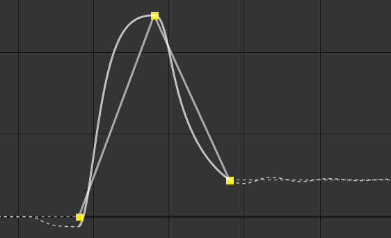  
*An animation curve generated by the Kleaner from three linear keyframes*

As you can see, the Kleaner adapts the generated animation to any keyframe available, which makes it easy to tweak the animation by just using a few linear keyframes.

You can use the Kleaner with any property which can have expressions.

1. **Select** the properties.
2. Click the ***{style="width:1em;"} Kleaner*** button.
3. **Choose** one of the presets.

!!! tip
    When using the Kleaner, just leave all your keyframes to linear interpolation and use the Kleaner to tweak the animation.

    For spatial properties, you should keep only the first and last keyframe of each movement to linear, and set all in-between keyframes to *rove across time*, using them only to tune the trajectory.

!!! tip
    The Kleaner is best used on multiple properties at once; this way you can control lots of movements with a single effect.  
    Spatial properties and other properties are handled a bit differently though, and it may be better to add the Kleaner twice for spatial properties and other properties separately.

You can adjust the settings and tweak the Kleaner with the effect Duik adds to the layer.

To make it easier to use and discover, the settings are divided in three parts:

- Some **general properties** describing the object being animated, like its weight and initial energy, or will, etc.
- **Detailed parameters** for all animation principles applied by the Kleaner, to let you go into small details if you wish, or customize the animation further.
- **Advanced settings** to control low-level parameters of the Kleaner.

!!! tip
    When you've applied the Kleaner on some properties and then want to use the same Kleaner on other properties, you can just copy and paste the expression in the new properties.

## Presets

When you click the ***{style="width:1em;"} Kleaner*** button, you have to choose one of these settings:

- **Alive** (anticipation + interpolation + follow through)  
    Use this preset with any character (or object, or part of a character) which moves voluntarily (i.e. the movement doesn't have an external cause, like gravity or a hit).  
    With this preset, the Kleaner applies an anticipation[*](../../misc/glossary.md) to the movement, then interpolates accordingly to the general parameters you'll choose, and ends the movement with a follow through[*](../../misc/glossary.md) animation. It also adds overlap[*](../../misc/glossary.md) and drag[*](../../misc/glossary.md) to spatial properties.
- **Inanimate** (interpolation  + follow through)  
    This is almost the same as the *Alive* preset, except the anticipation is disabled[^anticipate].
- **True stop** (anticipation + interpolation)  
    This is the same preset as the *Alive* preset, except there's no follow through at the end of the animation, to let you manually animate it.
- **Exact keyframes** (interpolation only)  
    With this preset, the Kleaner only interpolates between the keyframes, without anticipation nor follow through animation. With this setup, the resulting animation actually goes through the exact values of the keyframes, which may not be the case with the previous presets.
- **Spring** (follow through only)  
    Use this preset if you want to animate manually, but have an automatic follow through at the end of the animation. The Kleaner also adds some overlapping and dragging animation on spatial properties.
- **Spring** (no simulation)  
    This is the same preset as the previous one, except all simulations are disabled. This improves the performance a lot, but there won't be any overlapping and dragging animation on spatial properties anymore.
- **Bounce**  (follow through only)  
    This is the same as the *Spring* preset, but for objects bouncing on a surface instead of turning around the end value.
- **Bounce**  (no simulation)  
    This is the same as the *Spring* preset, but for objects bouncing on a surface instead of turning around the end value.
- **Limits**  
    Use this preset if all you need is to bound the values of the property inside some predefined (but animatable) limits.

[^anticipate]: Anticipation is an animation principle invented to show the *will*. You should never have anticipation if the movement is not voluntary, but an object *can* have an anticipation, if it is manipulated by a character for example.

## General parameters

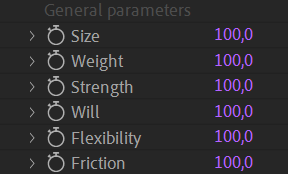

You can use these general parameters to set the main properties of the object being animated.

These are arbitrary, unitless values; if you *feel* the object is not heavy enough, raise a bit its *Weight*, that's all.

!!! note
    Duik and the Kleaner can do much for you. But **it can't move keyframes and change the duration of the animation**! If even with these settings your animation is too fast or the object feels too light, it may be because you need to adjust the timing[*](../../misc/glossary.md) of the animation, move the keyframes and make it longer, and vice versa.

    Before applying the Kleaner, try to time the animation the best you can (it's easier with the default easy-ease interpolation than linear keyframes, select the keyframes and hit `F9`).

Once you've set these values as best as you can, you can further improve and customize the animation by adjusting the fine tuning parameters.

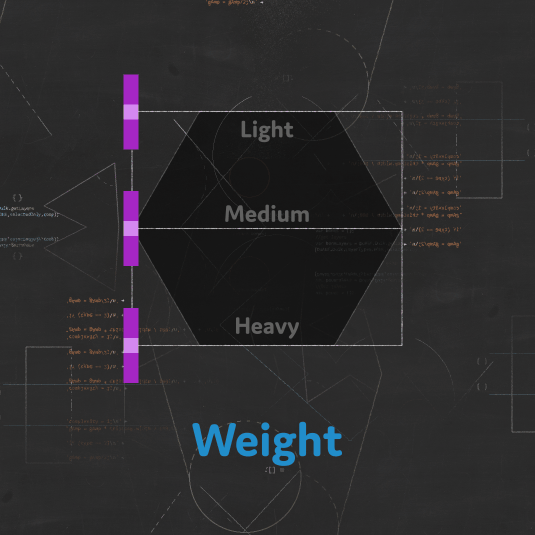

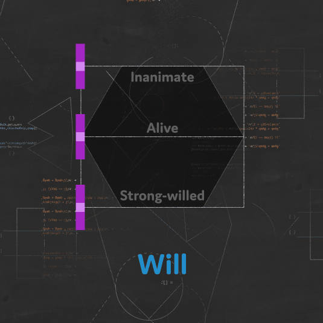

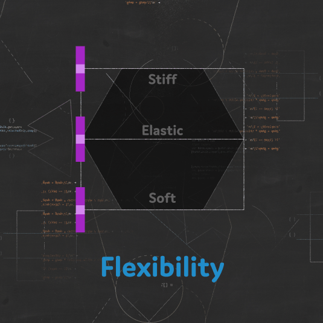

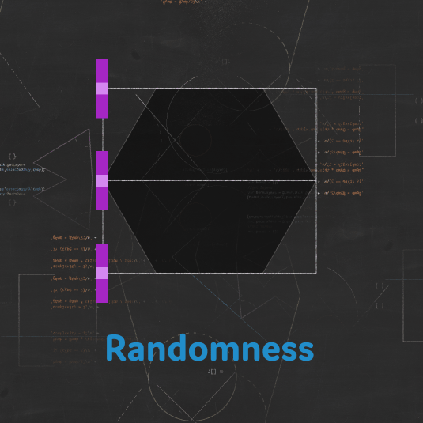

## Fine Tune

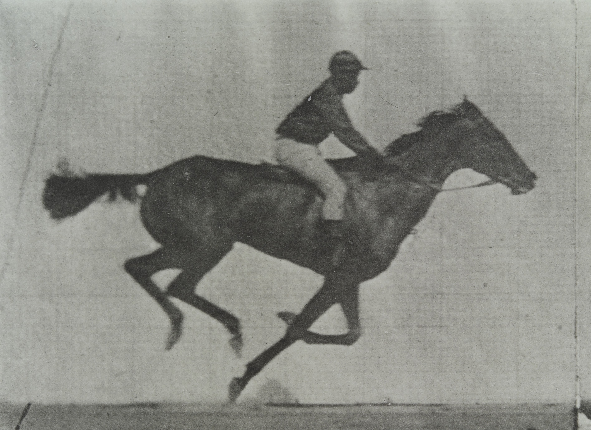{style="max-height:720px"}  
*A galloping horse and rider,  
Eadweard Muybridge, 1887   
Public domain.*{style="font-size:0.8em;"}

The Kleaner does a lot of things for you, effectively applying some general animation principles. What it does exactly also depends on the type of property being animated.

- ***Anticipation*** is what happens before the actual movement, to get momentum before moving the object. It's one of the 12 Disney's animation principles[^principles]. The *Will* is shown with the anticipation.
- The ***Motion Interpolation*** is what happens between the keyframes, it describes how the Kleaner *smooths* the animation and makes it more dynamic. It's mostly with this interpolation that the *Weight* of the object is shown, and the *Will* of the character, but almost all other general parameters are also used to tweak it.
- The ***Overlap***, or *drag*, is what makes objects *lag behind* their parents, the other objects they're attached to. The Kleaner is able to add overlapping animation and drag to **spatial properties**.
- The ***Follow through*** is what happens after the keyframes and the main animation. It is how the object oscillates or bounces on a surface before coming to a full stop.
- Duik is able to simulate ***Soft bodies*** if the Kleaner is applied on **spatial properties**. In this case, these spatial properties will lag a bit behind the main motion of the layer itself (similarly to the *overlap*), thus creating this *soft body* simulation. This works especially well on After Effects puppet pins, or any other effect deforming the layer.
- You can use the ***Limits*** to bound the values and make sure they don't go above or under specific values.

[^principles]: Disney's twelve basic principles of animation were introduced by the Disney animators Ollie Johnston and Frank Thomas in their 1981 book *The Illusion of Life: Disney Animation*. The principles are based on the work of Disney animators from the 1930s onwards, in their quest to produce more realistic animation. The main purpose of these principles was to produce an illusion that cartoon characters adhered to the basic laws of physics, but they also dealt with more abstract issues, such as emotional timing and character appeal. *cf.* [*Wikipedia*](https://en.wikipedia.org/wiki/Twelve_basic_principles_of_animation): [en.wikipedia.org/wiki/Twelve_basic_principles_of_animation](https://en.wikipedia.org/wiki/Twelve_basic_principles_of_animation)

### Anticipation

  
*This video is part of [__the official comprehensive video course about Duik Ángela__](https://rxlaboratory.org/product/the-official-comprehensive-video-course-about-duik-angela/)*

Anticipation[*](../../misc/glossary.md) is used to prepare the audience for an action, and to make the action appear more realistic. A dancer jumping off the floor has to bend the knees first; a golfer making a swing has to swing the club back first.

In a more technical way, it's the fact that *before* the actual movement, the object takes the opposite direction to get momentum.

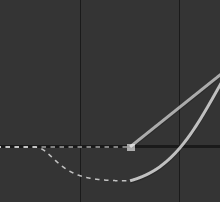  
*Anticipation generated by the Kleaner around a linear keyframe.*

First, the anticipation is computed according to the general parameters. You can then tweak it with these two simple values:

- ***Anticipation*** controls the amplitude of the anticpation.
- ***Duration*** changes how long before the first keyframe the anticipation starts.

### Motion interpolation

The Kleaner automatically interpolates[*](../../misc/glossary.md) the motion between keyframes, according to the general parameters.

For a more dynamic and realistic interpolation, it uses a function based on the Gaussian function which generates nice, asymetrical and dynamic curves, where the acceleration is faster than the deceleration, which better mimics a natural movement than what can be achieved with Bézier curve.

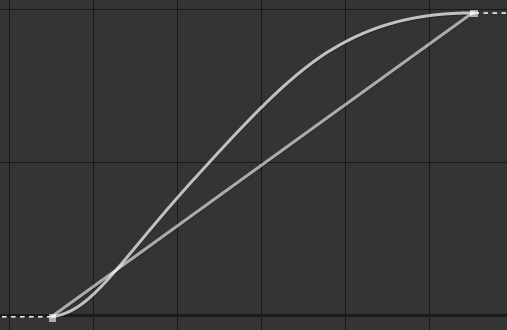  
*Interpolation generated by the Kleaner between two linear keyframes*

The Kleaner automatically generates the best curve possible going through all the keyframes, automatically detecting where the motion stops, slows down, accelerates or changes direction.

Use the ***Motion interpolation*** value to blend the result of the Kleaner with the actual After Effects interpolation; this way you can use your own Bézier interpolation if needed. You can animate this value to deactivate the Kleaner interpolation only for some part of the animation.

For spatial properties, if the ***Use Ae spatial trajectory*** box is checked, the Kleaner will not affect the spatial interpolation. This works very well if you just **set the first and last keyframe to linear interpolation, and all in-between keyframes to *rove across time***. In this case you just have to adjust the trajectory with the Bézier pen in the viewport, and let the Kleaner do the temporal interpolation; this is the recommended way of using it, but you can also disable this option, and let the Kleaner do all the work for you (spatial and temporal). In this case, the Kleaner will treat each axis separately as if the dimensions were separated.

### Overlap

*Overlapping action*[*](../../misc/glossary.md) is the tendency for parts of the body to move at different rates (an arm will move on different timing of the head and so on). A related technique is *drag*, where a character starts to move and parts of them take a few frames to catch up. These parts can be inanimate objects like clothing or the antenna on a car, or parts of the body, such as arms or hair. On the human body, the torso is the core, with arms, legs, head and hair appendices that normally follow the torso's movement. Body parts with much tissue, such as large stomachs and breasts, or the loose skin on a dog, are more prone to independent movement than bonier body parts.

The Kleaner helps you with this animation **when applied in spatial properties**. It checks the motion of all the parents of layer containing the spatial property to automatically delay it a bit and let it drag, according to the general parameters (weight, flexibility...).

This is considered a *simulation* and may reduce the performance of After Effects; it is deactivated when simulations are disabled in the *Advanced* parameters.

You can adjust the overlap by changing this value; set it to `0 %` to completely disable it (and improve performance).

!!! note
    There's no need to disable it on non-spatial properties where this value is not used at all.

### Follow through

*Follow through*[*](../../misc/glossary.md) means that loosely tied parts of a body should continue moving after the character has stopped and the parts should keep moving beyond the point where the character stopped only to be subsequently "pulled back" towards the center of mass or exhibiting various degrees of oscillation damping.

- The ***Flexibility*** controls both the amplitude and the frequency of the oscillation (which are closely tied in real life): with more flexibility, the frequency gets lower and the amplitude gets higher.
- The ***Duration*** controls the damping of the oscillation, how long it lasts before coming to a full stop.
- If the ***Bounce*** box is checked, instead of oscillating, the property will bounce on the last value, like a ball bouncing on a surface.
- The Kleaner generates accurate follow through, but sometimes you may prefer to ***amplify*** it a bit and make it more visible. This will adjust the height (the amplitude) of bounces. If you set the ***Amplification*** to `0 %`, you can also deactivate the follow through.

  
*An oscillating follow through generated by the Kleaner.*

  
*A bouncing follow through generated by the Kleaner.*

!!! note
    When oscillating, the frequency is stable and doesn't change until the object stops. When bouncing, the frequency raises (the bounces get shorter and shorter).

    The Kleaner being a tool for animators made by animators, it is not physically accurate; if it were, some bounces would happen *between* actual frames of the composition, which would be bad because there would be no frame where the contact between the object and the surface is visible. But the Kleaner makes sure all contacts happen exactly on actual frames of the composition, as an animator would do.

### Soft body

The *Soft body* *simulation* is very similar to the overlap, but specific for spatial properties other than the position of the layer, like After Effects puppet pins for example. The result is that the layer will appear flexible, soft, elastic, what's called a *soft body* in opposition to *rigid bodies*.

This is considered a *simulation* and may reduce the performance of After Effects; it is deactivated when simulations are disabled in the *Advanced* parameters.

You can adjust the soft body by changing this value; set it to `0 %` to completely disable it (and improve performance).

### Limits

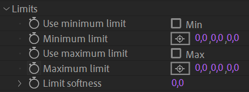

You can use the limits to make sure that even during the anticipation or final oscillation (follow through) the property with the Kleaner is bounded between this maximum and minimum limit.

Use the ***softness*** to make the motion slow down before hitting the limit.

!!! note
    When limits are used, they're also applied to the value of keyframes, effectively limiting the actual value no matter if it comes from the Kleaner or the keyframes.  
    It may be useful to apply the Kleaner on some property just to benefit from the limits, and a preset has been made just for this.

## Advanced Parameters

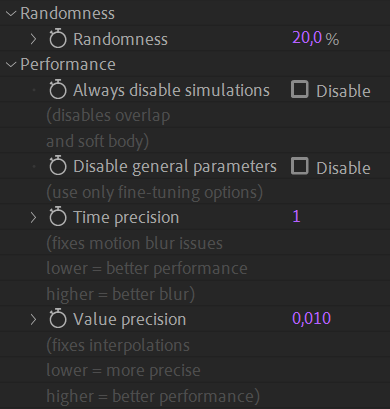

### Randomness

The Kleaner adds some randomness to some values to make sure that even if it's the same Kleaner controlling multiple properties, they will not be perfectly synchronized. This makes the animation feel much more natural. You can adjust this randomness, and set it to `0 %` to completely deactivate it.

### Performance

As a complete and complex tool, the Kleaner may reduce the performance of After Effects, especially when used on spatial properties.

You can use these settings to improve the performance by disabling the simulations or the general parameters if you don't need them.

If you notice artifacts in the motion blur or imprecision with some interpolations and follow through, you can raise a bit the  ***Time precision*** or ***Value precision***, but be careful as this may slow down the evaluation of the expressions.

