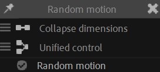

# {style="width:1em;"} Random motion

You can use this tool to generate an **animated random value** for some properties.

To the contrary of the [*Wiggle*](wiggle.md), this random motion is not interpolated: each value is completely random and does not evolve from the previous value. This makes the value jump from one value to the other without interpolation; this is very useful for faking traditionnal animation for example, to make cels jump around a bit like if they weren't perfectly aligned when scanned, or to generate very nervous random movements.

!!! warning
    This tool is not to be confused with the [*Randomize*](tools/randomize.md) [^randomize] tool which generates random values which are not animated, and which can be used for all kind of attributes, and not only properties.

1. **Select** the properties
2. Click the {style="width:1em;"} ***Random motion*** button

!!! Tip
    When you’ve applied the Random motion on some properties and then want to use the same Random motion on other properties, you can just copy and paste the expression in the new properties.

## Effect

The Random motion can be adjusted in the effects of the first selected layer.

You can check the ***link dimensions*** option to use the same values on the X and Y axis; this is useful for scale properties for example.

The ***details*** section contains more advanced properties.

The ***Natural (gaussian distribution)* mode** feels more realistic and natural; when used in a position for example, the layer will jump around the center of the original position, in a circular area. But with this mode, the values may jump  further away than the exact amplitude.  
The ***Strict* mode** feels less natural, but the values are strictly bounded by the given amplitude.

The ***random seed*** is used to generate the pseudo-randomness of the random motion. It is set to the index of the layer by default.

## Other options

Before adding the random motion to the selected properties, you can set some options in the {style="width:1em;"} additional panel.

- Dimensions  
    - {style="width:1em;"} ***Collapse dimensions***: use a single amplitude and frequency for all dimensions (or channels for colors).
    - {style="width:1em;"} ***Split values***: separate amplitude and frequency values for each dimension or color channel.
- Controls  
    - {style="width:1em;"} ***Unified control***: create a single effect for all selected properties.
    - {style="width:1em;"} ***Individual controls***: create an effect for each selected property.

[^randomize]: *cf. [Automation](index.md) / Tools / [Randomize](tools/randomize.md)*.
