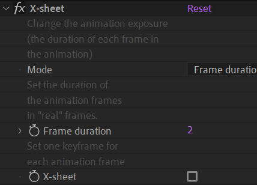

# {style="width:1em;"} X-Sheet

The *X-Sheet* (read *cross sheet*), a.k.a. *exposure sheet* or *dope sheet* is a tool to control the animation exposure[*](../../misc/glossary.md) over time. It is a very useful tool when compositing traditional (cel[*](../../misc/glossary.md)) animation or to fake traditional animation. It can change the framerate of the composition or of the properties at any time, mixing framerates in the same composition, for different layers or at different times.

_The_Sinking_of_the_Lusitania_-_signed_cel_(shadow_of_U-Boat).jpg)  
*A cel from the animated film The Sinking of the Lusitania,  
Winsor McCay, 1918  
Public domain.*{style="font-size:0.8em;"}

There are two ways to create a X-Sheet:

- For the whole composition:  
    1. Make sure **nothing is selected**.
    2. Click the {style="width:1em;"} ***X-Sheet*** button.
    3. The X-Sheet is created as an adjustment layer on top of the composition.
- For specific properties only:  
    1. **Select** the properties.
    2. Click the {style="width:1em;"} ***X-Sheet*** button.
    3. The X-Sheet is created as an effect on the layer, with expressions in the properties.

## Effect

In both cases, the X-Sheet can be controlled from the effect created by Duik.

All the **Mode** actually do the same thing but change the way you can control the exposure:

- **`Frame duration`** lets you set the duration of the frames.  
    With this mode, you can set, and animate, the **Frame duration** property, to change the exposure. If you set it to `2` for example, the property will be animated ***on twos***. This means that each frame of the animation lasts two actual frames of the composition.
- **`X-Sheet`**, **`Layer markers`**, **`Comp markers`** let you manuall set the exact time where the frame has to change.  
    With  this mode, you set all the times at which you'd like the animation to go a step further, using either the **X-Sheet** property (setting keyframes on it), or markers on the layer or the composition.  
    At each keyframe or marker, the frame (cel) will change. For example, to animate on twos, you'd add a keyframe or marker every two frames of the composition.

!!! tip
    A fake traditional animation look is better using variable animation exposure than just setting the composition framerate to 12 frames per second. In actual traditional animation (except *Disney*[^williams]), very often the exposure varies: it is higher (less frames, smaller frame rate) on slow movements and lower on fast movements, to give the necessary fluidity when the motion needs it, but save work otherwise. This is still a great way to emphasize emotions vs dynamic actions.

[^williams]: If you read *The Animator's Survival Kit* (and you must read it if you're interested in character animation) by Richard Williams (former Disney animator) you'll see that at Disney, there's no better animation than *at least* 24 frames per second animation, with the smoothest and most fluid motion possible. You have the right to disagree, that's a very cultural point of view, and on the opposite side one can argue that Japanese animation does an awesome work on emotions with very few frames.

