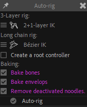

# {style="width:1em;"} Auto-rig

The Auto-rig in Duik Ángela is a versatile and smart tool which adapts to a lot of different situations. This makes it the cornerstone of the rigging process in Duik, which can be summarized to:

1. Create Bones
2. Auto-rig
3. Animate

As a smart tool, it will guess what you are trying to do, depending on the layers you have selected. It is able to add some “simple” IK or to rig a complete character in a single click.

!!! note
    The *Auto-rig* is a tool in constant evolution. In each future version of Duik, it is going to work better and better, handling more different situations.

## Using the Auto-rig

1. Select some layers in the composition
2. Click the Auto-rig button.
    - **If there are bones** in the selection:
        - If there are predefined armatures (arm, leg, spine, tail...), the Auto-rig will rig everything for you so you can start to animate rught afterwards.
        - If the bones are custom armatures, the Auto-rig will add [IK](../../constraints/kinematics.md)[^1] to rig them, determining which type of IK would be best according to the number and location of the layers, and the auto-rig settings.
    - **If there are Controller layers** in the selection:  
    The Auto-rig will use them when possible, depending on their location, instead of creating new controllers. This is an easy way to use your own cuystom controllers (you just have to make sure they're [tagged](../../controllers/tools/tag.md)).[^2]
    - **If the selection is made only of standard layers**, the Auto-rig will add IK to rig them, trying to guess how they need to be rigged using their parenting and the location of their anchor points. If the layers are not parented yet, the Auto-rig is able to parent them automatically, but it’s better in this case to select the layers in the right order: from the tip to the root of the limb (from hand to shoulder, or from foot to hip…).

## Controllers

As opposed to previous versions of Duik, the Auto-rig in Duik Bassel is able to create any needed controllers to rig the selected layers. You do not necessarily have to create them yourself first.

This being said, if you need or want to add and use a specific controller, you just have to include it in the layer selection before running the Auto-rig. It will automatically detect and use it. This is especially useful if, for example, you want to control two different IKs with the same controller.

!!! tip
    Always have a look in the effects of the Controllers after having run the Auto-rig! Depending on what has been rigged, there may be a lot of options there.

## Auto-rig options

When rigging less than three layers, the auto-rig always know what to do, as it is able to create controllers to animate both using FK and IK at the same time, but with more layers, you can set the preferred behavior in the auto-rig options.

With three bones you can use one of these methods:

- ***1+2-layer IK*** creates a single-layer IK on the root, and a two-layer IK on the remaining two parts of the limb. Both are controlled with the same controller. This is the default way of rigging arthropod legs for example.
- ***2+1-layer IK*** creates a two-layer IK on the first two parts of the limb, and a single-layer IK to control the last part. Both are controlled with the same controller.
- ***FK*** creates an FK controller, which has automatic overlapping animation options.
- ***Bézier IK*** is a kind of IK controlled by Bézier functions, similar to Bézier paths in After Effects; this is espacially useful for tails or spines for example, when you want to achieve a smooth curve.
- ***Bézier FK*** combines a Bézier IK with FK controls, to be able to animate the IK use the rotation properties of the controllers at each end.

You can also set your preference for longer chains made of more than three bones, tails and hair strands. In this case, the choice is limited to: *FK*, *Bézier IK*, *Bézier FK*.

▷ Read the [*Constraints / Kinematics*](../../constraints/kinematics.md) section for more details about these options.

If you **check the *Create a root controller* box**, the Auto-rig will **add a root, master controller** which can be used to translate and rotate the whole rig at once.

Use the **baking options** to automatically [bake](../tools/bake.md)[^3] the bones before rigging them; this is important **to improve the performance** of the rig. It will "freeze" the bones as they are at the moment you rig them, as you should not need to change their appearance anymore.

## All types of animals and limbs

Duik can create armatures for almost all type of animals and limbs, and the auto-rig can rig them automatically.

Although the type of limbs are sorted into categories corresponding to different types of animals, you can combine arbitrarilly limbs from different categories. You could see these categories as different ways to rig and control the limbs, according to the way your character moves. This way you can create and rig any kind of character, from hybrids to robots.

- [{style="width:1.2em;"} {style="width:1.2em;"} **Arms and legs**](leg.md)
- [{style="width:1.2em;"} **Spines**](spine.md)
- [{style="width:1.2em;"} {style="width:1.2em;"} **Tails and hair**](tail.md)
- [{style="width:1.2em;"} **Wings**](wing.md)
- [{style="width:1.2em;"} **Fins**](fin.md)

!!! tip
    You can use the [OCO meta-rigs](../../oco/index.md)[^4] as examples of how you can combine limbs to create complete animals.

[^1]: *cf.* [*Constraints / Kinematics*](../../constraints/kinematics.md).

[^2]: *cf.* [*Controllers*](../../controllers/index.md).

[^3]: *cf.* [*Bones / Tools / Bake bones*](../tools/bake.md).

[^4]: *cf.* [*Meta-rigs and OCO*](../../oco/index.md).
