# {style="width:1em;"} {style="width:1em;"} Arms and legs

  
*This video is part of [__the official comprehensive video course about Duik Ángela__](https://rxlaboratory.org/product/the-official-comprehensive-video-course-about-duik-angela/)*

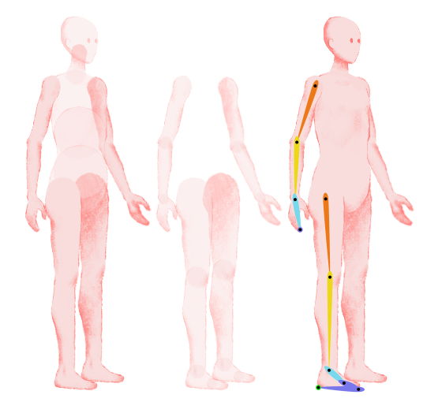

For both [tetrapods](https://en.wikipedia.org/wiki/Tetrapod)[^1] and [arthropods](https://en.wikipedia.org/wiki/Arthropod)[^2] (i.e. all legged animals), the rig for arms, front legs and back legs is similar; the only difference is that for tetrapods, there may be a shoulder bone at the root of the limb, and of course the side of the elbow on the front leg and the knee on the back leg are reversed.

For all these legs, Duik creates a control at the end (on the foot or hand), and depending on the bones available in the armature (thus depending on how you've designed the limb)[^3], some controls for specific joints of the limb are available in the effects of the controller layer.

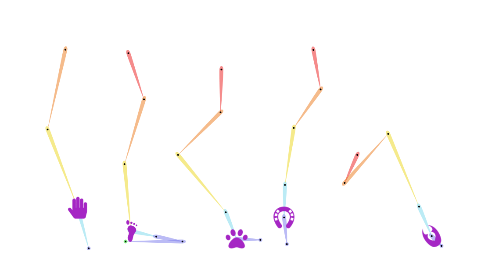  
*Front legs*

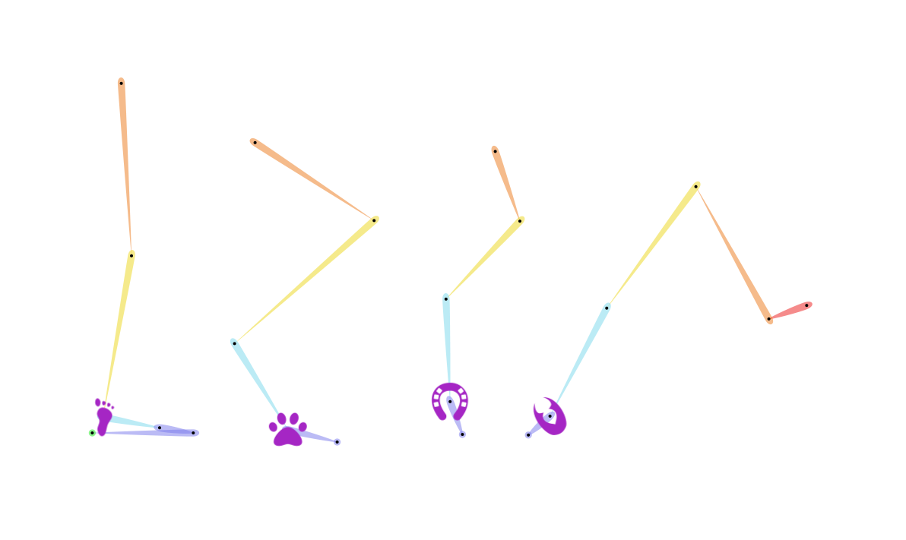  
*Back legs*

!!! note
    All tetrapods (four-legged animals) have the same joints on the legs, and although they may *seem* to be reversed, it's never actually the case.

    For example, it may seem that the knee is reversed on wading birds compared to mammals, but the joint we see as the knee is actually the ankle, the knee being hidden higher under the feathers.

When rigging legs, Duik creates a single controller with all the detailed controls in its effects. For all legs, there is *at least* one IK Effect which controls the main part of the limb, and according to the type of animal, the available bones in the limbs, or what was selected when running the auto-rig, there may be other effects to control other joints of the limb.

Read the [*Constraints / Kinematics*](../../constraints/kinematics.md) section for more details about the IK and FK effects.

## {style="width:1em;"} {style="width:1em;"} Hominoids and plantigrades

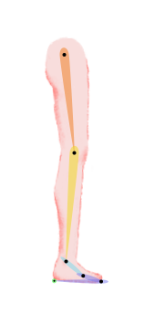  
*A typical plantigrade leg, with all possible joints and bones*

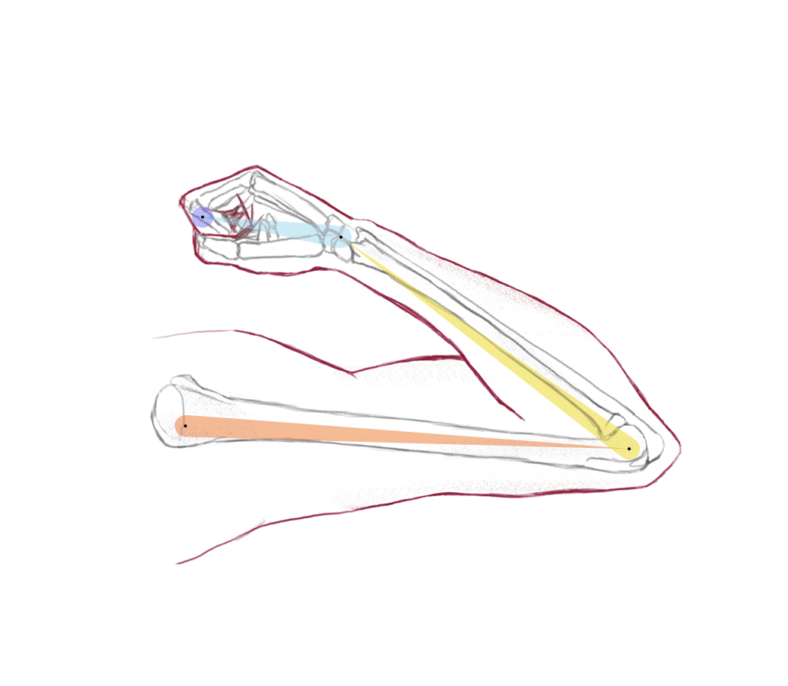  
*A typical human arm, shoulder not included*

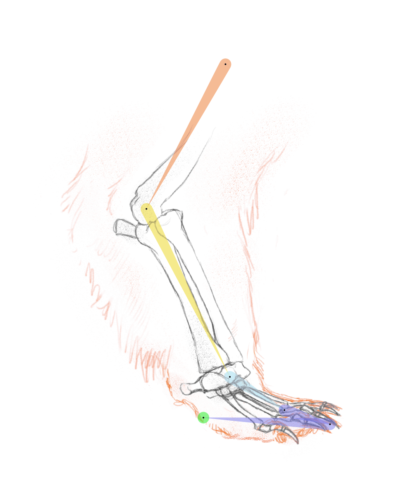  
*A typical plantigrade (bear) front leg, shoulder not included*

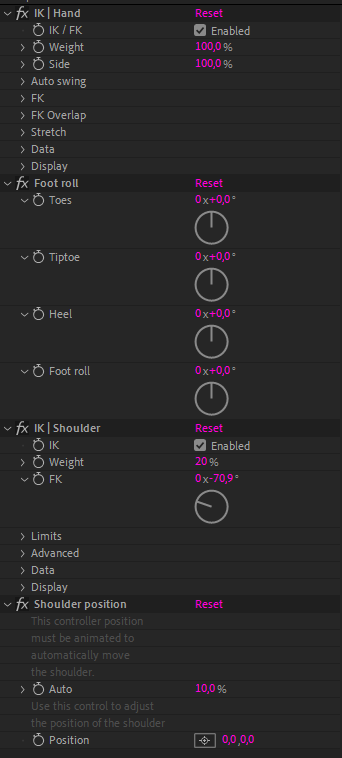

Additionally to the IK controlling the thigh and calf, or arm and forearm parts of the limb, the following effects may be available.

### Foot roll

The foot roll effect is available only if the leg is a standard leg made of two parts (a thigh and a calf).

Use this effect to control all possible rotations of the foot, using different anchor points:

- The *Toes* angle simply rotates the toes (or claws).
- The *Tiptoe* angle rotates the foot from its tip, its very end, like a dancer tiptoeing.
- The *Heel* angle rotates the foot from the point of contact between the heel and the ground.
- The *Foot roll* angle is a very useful control when animating a walk for example. Negative values rotate the foot the same way as the *Heel* value, and positive values raise the heel by rotating it around the toe joint, which happens at the end of each step during the walk, when the foot is behind the character, just before it raises to go forward again.

!!! note
    Some of these controls have a slightly different effect if the toes aren't separated from the foot, if there's no joint between the foot and the toes.

As all these values rotate (part of) the foot using different pivots, they should never be used at the same time. When one of these values is set, the three other values should always be 0&nbsp;° (the foot can't rotate using multiple pivots at the same time).

!!! note
    Rotate the controller itself to rotate the foot from the ankle.

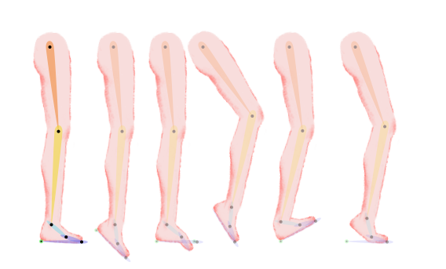  
*Different ways to rotate the foot: Rest pose, Foot rotation (using the controller),* Toe *angle,* Tiptoe *angle,* Heel *angle, and* Foot Roll *angle. Notice how the three last angles also move the knee.*

For a precise control of the foot, make sure all joints and bones are perfectly located, especially the toe bone, the tip, and the heel, as shown on the picture above.

!!! tip
    The *Tiptoe*, *Heel*, and *Foot roll* values all move the knee when they're animated, and make it difficult to control precisely the movement of the knee and the leg. You should avoid animating them when possible.

### Shoulder controls

The two shoulder effects are available if the limb is an arm or front leg, and a shoulder bone has been included.

- The *IK* effect controls the rotation of the shoulder; an automatic rotation occurs when the hand moves, according to the *Weight* value of this effect. Use the *FK* value to manually adjust or animate the rotation of the shoulder.
- The *Shoulder position* effect controls the position of the shoulder. An automatic translation of the shoulder can be controlled with the *Auto* effect, but be aware that this movement happens if and only if there's an actual animation (with keyframes or expressions), and *not* when just manipulating the controller.  
Use the *Position* value to manually adjust or animate the position of the shoulder.

## {style="width:1em;"} Digitigrades

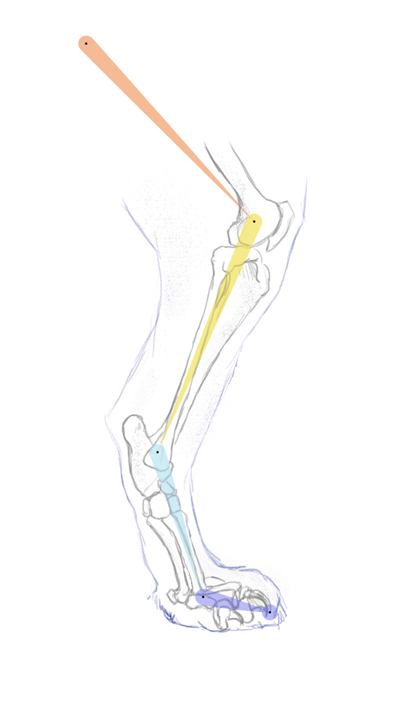  
*A typical digitigrade (cat) back leg*

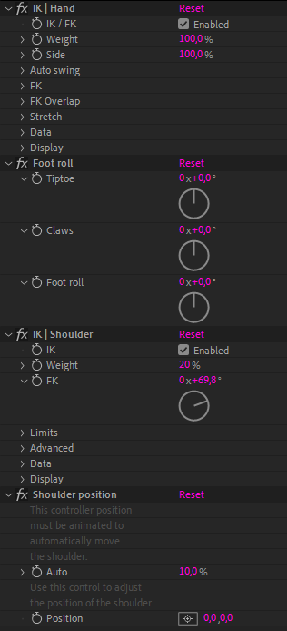

Additionally to the IK controlling the thigh and calf, or arm and forearm parts of the limb, the following effects may be available.

### Foot roll

The foot roll effect is available only if the leg is a standard leg made of two parts (a thigh and a calf, or an arm and a forearm) and the toes/claws are separated from the foot (i.e. the toe joint can be rotated).

Use this effect to control all possible rotations of the foot, using different anchor points:

- The *Tiptoe* angle rotates the foot from its tip, its very end, like a dancer tiptoeing.
- The *Claws* angle rotates the fingers or claws.
- The *Foot roll* angle is a very useful control when animating a walk for example. It rotates the foot around the fingers/claws joint.

As the *Tiptoe* and *Foot roll* values rotate (part of) the foot using different pivots, they should never be used at the same time. When one of these values is set, the other value should always be 0&nbsp;° (the foot can't rotate using multiple pivots at the same time).

!!! note
    To the contrrary of plantigrades, the rotation of the controller itself, which rotates the whole foot around the toe joint, may not be very useful in this rig.

For a precise control of the foot, make sure all joints and bones are perfectly located, especially the toe bone and the tip, as shown on the picture above.

!!! tip
    The *Tiptoe* and *Foot roll* values both move the knee when they're animated, and make it difficult to control precisely the movement of the knee and the leg. You should avoid animating them when possible.

### Shoulder controls

The two shoulder effects are available if the limb is an arm or front leg, and a shoulder bone has been included.

- The *IK* effect controls the rotation of the shoulder; an automatic rotation occurs when the hand moves, according to the *Weight* value of this effect. Use the *FK* value to manually adjust or animate the rotation of the shoulder.
- The *Shoulder position* effect controls the position of the shoulder. An automatic translation of the shoulder can be controlled with the *Auto* effect, but be aware that this movement happens if and only if there's an actual animation (with keyframes or expressions), and *not* when just manipulating the controller.  
Use the *Position* value to manually adjust or animate the position of the shoulder.

## {style="width:1em;"} Ungulate

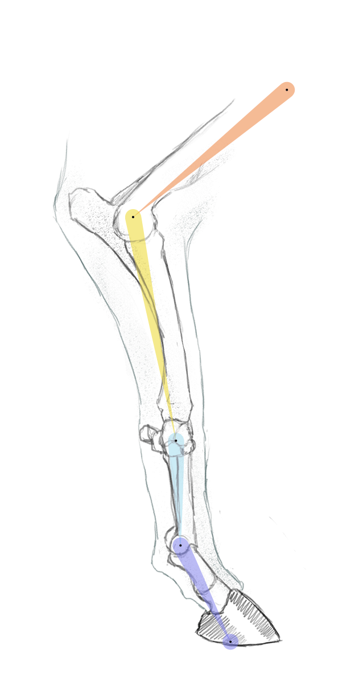  
*A typical ungulate (horse) front leg, shoulder not included*

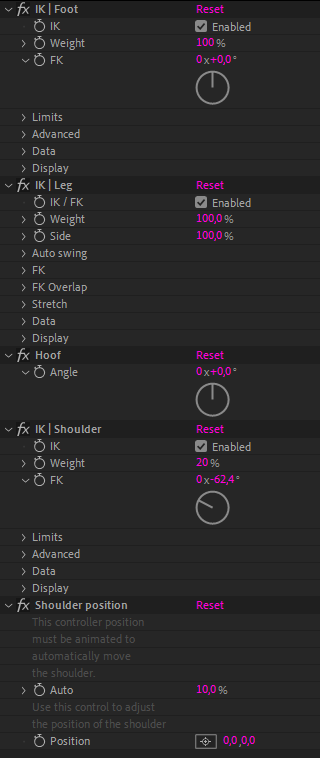

Additionally to the IK controlling the thigh and calf, or arm and forearm parts of the limb, the following effects may be available.

### IK | Foot

This single-layer IK controls the orientation of the whole foot (including the hoof).

### Hoof

This simple angle controls the rotation of the hoof. It is to be used when the leg is not standing and in contact with the ground.

The rotation of the controller itself rotates the foot around the hoof joint, a bit like what the *Foot Roll* values do with the plantigrade and digitigrade rigs.

### Shoulder controls

The two shoulder effects are available if the limb is an arm or front leg, and a shoulder bone has been included.

- The *IK* effect controls the rotation of the shoulder; an automatic rotation occurs when the hand moves, according to the *Weight* value of this effect. Use the *FK* value to manually adjust or animate the rotation of the shoulder.
- The *Shoulder position* effect controls the position of the shoulder. An automatic translation of the shoulder can be controlled with the *Auto* effect, but be aware that this movement happens if and only if there's an actual animation (with keyframes or expressions), and *not* when just manipulating the controller.  
Use the *Position* value to manually adjust or animate the position of the shoulder.

## {style="width:1em;"} Arthropod

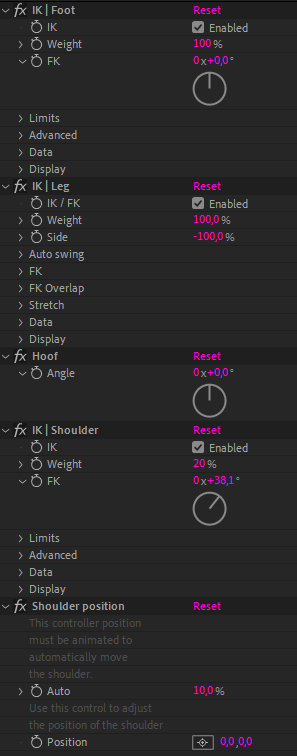

The arthropod rig, in the current version of Duik, is actually similar to the ungulate rig, and has the same controls and effects. Only the initial locations of the joints and length ratios of the different parts of the limbs differ.

[^1]: [***Tetrapods***](https://en.wikipedia.org/wiki/Tetrapod) are four-limbed vertebrate animals constituting the superclass Tetrapoda. It includes amphibians, reptiles, dinosaurs, birds, mammals and other extinct classes.

[^2]: [***Arthropods***](https://en.wikipedia.org/wiki/Arthropod) are invertebrates with segmented bodies and jointed limbs. It includes arachnids (spiders, scorpions, ticks, mites...), myriapods (millipedes...), crustaceans (shrimps, crabs, lobsters...), and hexapods (insects).

[^3]: *cf.* [*Bones / Create bones*](../create-bones.md)

