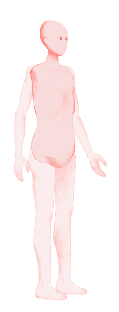
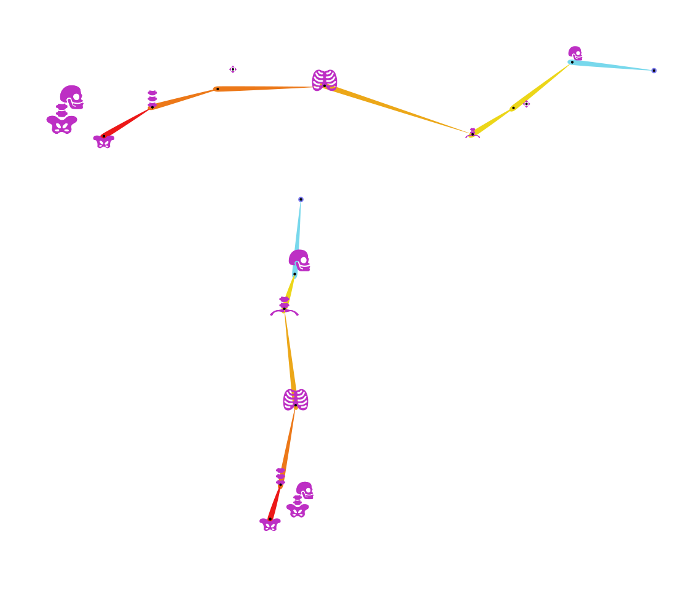

# {style="width:1em;"} Spines

In Duik, what's called spine includes the actual spine, and the hips and head.

For all types of animals, spines are rigged the same way, except for fishes, for which spines are actually rigged as tails.

The controllers created when rigging spines may differ according to the way the character is designed and the available joints. All possible controllers are:

- **Body**: This controller moves the whole body, including the head. It's the one to be animated up and down in a walk cycle for example, but except for this specific case, it's more subtle to animate the other controllers of the spine. This controller is always available for all kind of spines.
- **Hips**: This controller moves only the hips, and thus bends the spine. It's especially useful to animate its rotation.
- **Spine**: This controller can only be rotated. It rotates the whole spine up to the torso, in a very natural way if the spine is made of multiple bones.
- **Spine Curve**: This controller can be moved to adjust the curvature of the spine if it is made of multiple bones.
- **Torso**: This controller controls the torso. Although it can be moved (using IK), it's easier to animate the rotation of the spine and just rotate the torso too instead of animating its position.
- **Neck and Shoulders**: The position of this controller moves the shoulders (and thus rotates the torso with the IK), but it's usually easier to animate the rotation of the torso instead. The rotation of this controller can be used to animate the neck.
- **Head**: This controller's rotation can be animated to control the head. Again, although its position can be animated, it's usually easier to animate the rotation of the neck.

As usual, it's much easier to animate the rotation of the available controllers (FK) than their position (IK), even if for beginners animating the position might seem more intuitive.

**TODO** add the controller icons in the list above

!!! tip
    When rigging insects, it's better to rig the abdomen as a tail, and use a simple spine rigging for just the thorax and the head; that makes more sense in terms of animation.