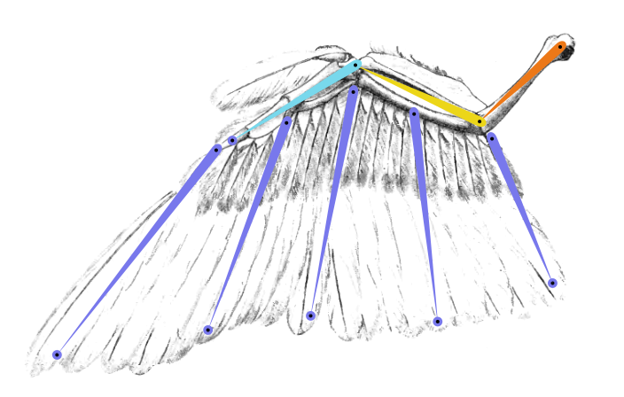
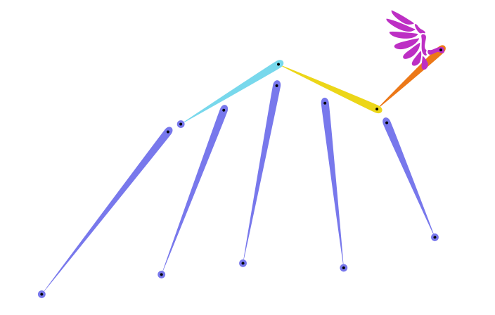
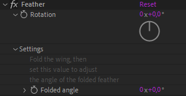

# {style="width:1em;"} Wings

Like all [tetrapods](https://en.wikipedia.org/wiki/Tetrapod), bird wings, and bat wings, consist of an arm, a forearm and a hand with fingers. Both bird and bat wings can be rigged the same way with Duik: birds have feathers attached to the arm, and the Duik wing armature includes bones for these feathers. The feather bones can be used to rig the actual fingers of the bats which have the same role as feathers for birds.

!!! Warning
    To the contrary of other limbs, there is an additional step to correctly rig the wings after you've selected the bones and run the Auto-Rig. Read below.

The Auto-rig creates a single controller for the whole wing: most of the animation can be automated and controlled from the rotation, position and a few properties in the effect of this controller.

!!! tip
    It's not necessary to create one bone for each feather. All feathers can be controlled by fewer bones, and cleverly using orientation constraints[^1] for example; this will improve the performance, which can drop drastically with too many feather bones.

But before being able to animate correctly the wing (especially to fold and unfold it), you have to adjust a setting for each of the Feather effects.

1. Fold the wing, using the *Fold wing* property in the Wing effect on the controller.
2. For each feather, adjust the *Folded angle* property in the corresponding Feather effect on the controller, so the wing looks nice when folded.
3. You can now unfold the wing and animate everything on the wing, the setup is finished.

## Wing effect

  
*The effect to control the wing.*

The Wing rig is similar to a standard FK control, except it also handles automatically the rotation and animation of the feathers.

You can animate the rotation of the controller to flap the wing, and animate each part of the arm individually in the Wing effect.

The *Fold wing* property in the effect can be used to animate the folding and unfolding of the wing very easily.

The *General parameters* section contains a few properties to adjust the settings of the wing:

- *Forearm orientation* controls whether the forearm should rotate with the arm or keep its own orientation. The choice depends on the animation you're working on, and your personal preference.
- *Wing flexibility* and *Air resistance* are the two usual settings which come with the automatic overlapping animation Duik generates with FK controls[^2].

Finally, you can control how the wings attached to the *hand* part of the arm should rotate with the *Hand rotation multiplicator* in the *Feather parameters* section of the effect; changing this ratio adjusts the amplitude of the movement of the feathers when the wing flaps.

## Feather effect

  
*An effect to control and adjust a feather.*

Use the *Rotation* property to control the rotation of each feather individually if you need.

The *Settings* section is to be used only during the rigging process and should not be changed afterwards (read above).

!!! note
    Duik Wing rigs can be used for all view axis, the character being viewed either from the top, the face or the side.

[^1]: *cf.* [*Constraints / Transform constraints*](../../constraints/transform.md).

[^2]: *cf.* [*Constraints / Kinematics (IK and FK)*](../../constraints/kinematics.md).

