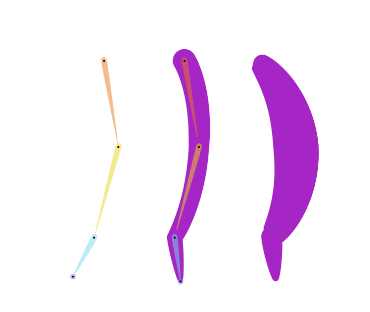
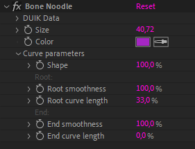
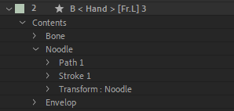

# Bone noodles

  
*This video is part of [__the official comprehensive video course about Duik Ángela__](https://rxlaboratory.org/product/the-official-comprehensive-video-course-about-duik-angela/)*

A bit like envelops, noodles are content added in the bone layers and can be used to quickly design a vector limb or character. They draw a smooth shape going through all the joints of the limb, to create a kind of cartoony, smooth, rubber limb.

!!! note
    Noodles are available only with *Full bones*. Read the [*Bones and Auto-rig / Tools / Settings*](tools/settings.md) section for more information about this setting.

The noodles can be customized using the effect on each bone layer, and they can be activated or deactivated by just activating or deactivating the effect.

There you can adjust their size and appearance.

Use the *Curve parameters* section to adjust how they curve, on the root or the end side of the bone; by default, noodles are set to be the smoothest possible shape going through all the joints of the limb.

!!! tip
    To set a joint to be a sharp angle instead of a smooth curve, set the *End curve length* on the bone before the joint to `0 %` and the *Root curve length* on the bone after to joint to `0 %` too.

Just like the envelops, you can further customize these noodles by just modifying and adding contents in the bone shape layer.

