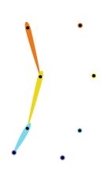

# {style="width:1em;"} Bone settings

  
*This video is part of __the official comprehensive video course about Duik Ángela__*

There are two types of bones in Duik, which can be chosen on top of this panel.

- **Full bones**, the default, are bones with their envelops and noodles, and all options to control their appearance. They're displayed as links between the joints.
- **Light bones** are much simpler bones, without any envelop or noodle, and displayed dots on the joints. Their big advantage is their performance: they have a minimal impact on the rendering process and expression evaluation. This is the best choice for heavy projects if you don't need fancy envelops or noodles[^1].

  
*Full bones vs. Light bones*

Apart from their appearance and the presence of envelops and bones, both bone types have the exact same features and work the same way with the Auto-Rig.

You can use the other bone settings to change the appearance of the selected bones. The *Pick selected layer* button will pick all values from the selected bone to easily apply the same settings to other bones.

[^1]: Read the [*Advanced / Performance*](../../../advanced/performance.md) section for more tips about how to improve performance in After Effects and using Duik.