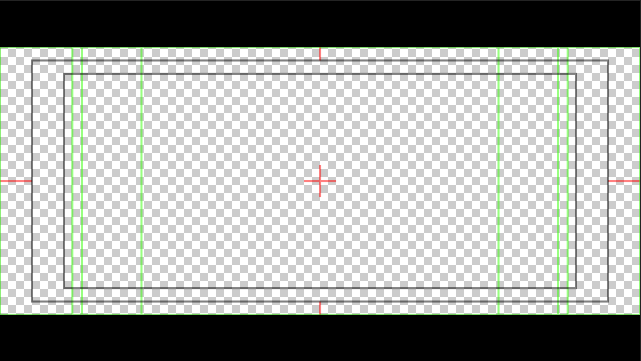
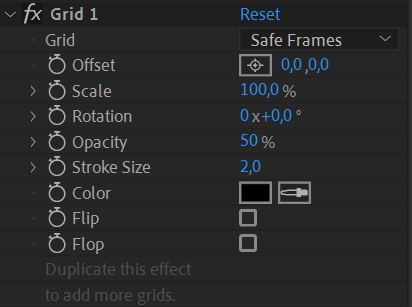
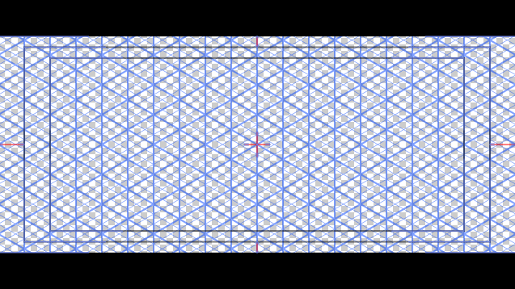
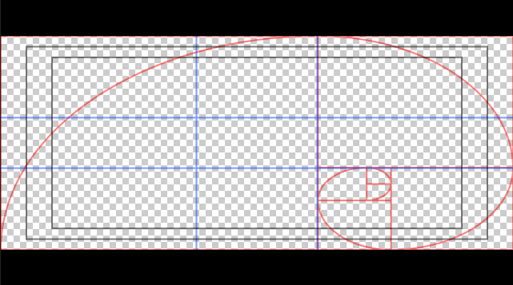

# {style="width:1em;"} Framing grids and guides.

This very simple tool creates different types of grids and guides on a Shape Layer, which you can extensively configure, to help the composition of the image.

  
*These are the default frame and guides added when you apply the preset.*

## Frame

The first effect added to the layer lets you configure the frame.

- **Format Presets**:  
    - ***Custom*** lets you specify the format using the Format value.  
    - ***Composition*** will compute the current aspect ratio of the composition, so you can know what it is in the *Format* value.
    - The other formats in the list are relatively common formats (some older, some more recent) which can be useful. The current standard for video is *16/9*, and for digital cinema they are *DCP Flat* and *DCP Scope*.

- **Format**: 
    This value lets you read the format of the selected preset, or set your own format if you’ve set the preset to *Custom*.

- **Appearance**: 
    The values in this section are used to adjust the appearance of the frame (its color, opacity, etc.).

- **Computed Size (Read only)**: 
    This is the size of the resulting frame, in pixels.

## Grids

The other effects are used to adjust the grids and guides.

You can have as many guides as you want, you just have to duplicate a grid effect to add a new one. The only limitation is that you cannot have twice the same type of grid or guide, but you can always duplicate the layer itself if you need.

You can temporarily hide a specific grid or guide by disabling the corresponding effect.

- **Safe Frames** displays standard “action” and “title” safe frames, which represents respectively 80% and 90% of the surface of the entire frame.
- **Digital Frames** shows the standard digital formats (4/3, 16/9, 1.85, 2.35) contained in the current frame. This way you can make sure your composition works even if the image is later cropped to another format.
- **Golden Rectangle** divides the image using the golden ratio.
- **Golden Fibonacci** draws the famous Fibonacci spiral, but adjusted using the golden ratio to fit the entire image.
- **Real Fibonacci** draws the true Fibonacci spiral, with its accurate proportions.
- **Isometric** draws an isometric guide very helpful when designing… isometric perspectives.

