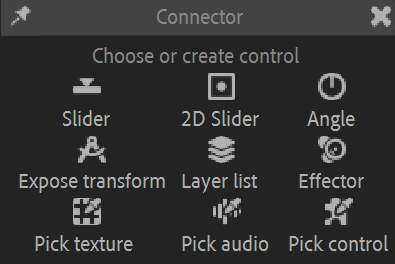
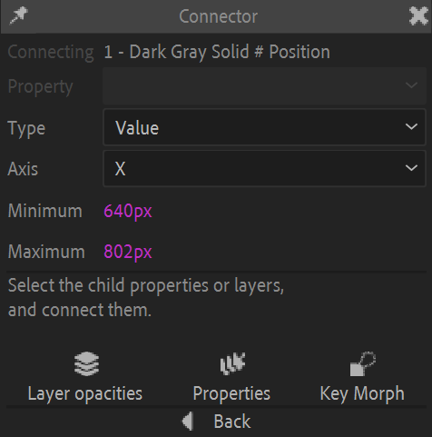
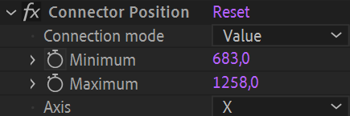
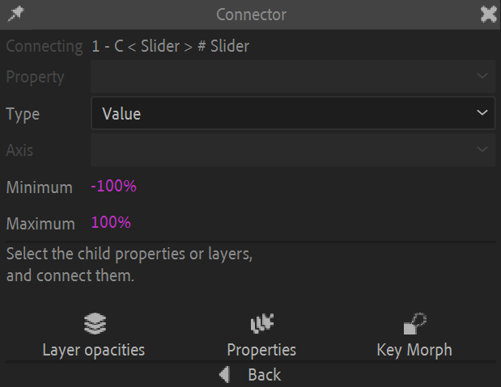
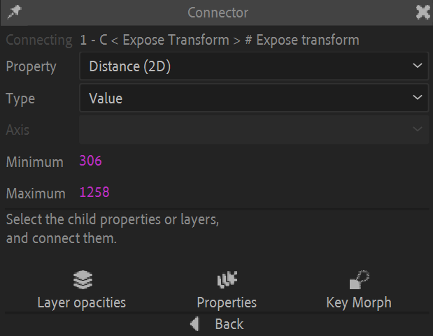
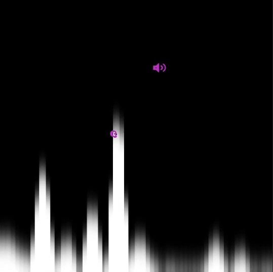
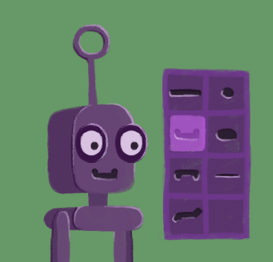
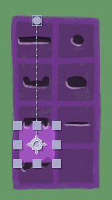

# {style="width:1em;"} Connector

The connector is a simple yet very powerful tool to automate all kind of cause-and-consequence link between properties. Every time you need the value of any property react to the change of any other property, you should be able to use the connector to build the automation.

It simply drives a *slave*[^1] property (or several slave properties) according to the values of a master property, a bit like what parenting does with the transformation of layers.

A single master property can control many slave properties, but to the contrary of a standard parenting (or using the native expression pickwhip in After Effects), a single slave property can be driven by several master properties. There are multiple ways to achieve that, explained in the end of this section.

  
*This video is part of [__the official comprehensive video course about Duik Ángela__](https://rxlaboratory.org/product/the-official-comprehensive-video-course-about-duik-angela/)*

## Before the connection

All the properties which need to be animated together are prepared using keyframes. It's these keyframes which will be controlled by the master property, a bit like a time-remapping would do.

The first step is to animate these slave properties; you can use as many keyframes as you need, and precisely adjust the interpolations[*](../../misc/glossary.md) if needed. You just have to make sure all the animations of the slave properties have exactly the same duration; if an animation needs to start after or end before the others, just copy and paste the first or last keyframe so that it starts or ends with a still part.

  
*All animations must have the same duration*

Any property of any type which can be controlled by an expression can be connected using the Connector!

## Quick Connector

The quick connector creates a master slider in the effects of the selected layer, and connects all selected slave properties to this new slider.

The movement of the slave properties is controlled by their own keyframes, and can still be adjusted after the connection if needed.

  
*In this simple example, the* connector *effect controls the position and the rotation of the layer.*

It can be used to quickly animate many properties at once, and make sure all have the same interpolation. As the slider is a simple percentage, it is very easy to animate and set the ease influences and velocities on the keyframes.

!!! tip
    For example, it is a great way to animate the scale and position of a layer and having these properties perfectly synced, even when using complex Bézier interpolations with the graph editor. More generally, it is a great way to animate many properties and layers at once, when they need to be synced.

To use the quick connector, follow these simple steps:

1. **Animate the slave properties**, the properties to be controlled, from their initial to final state. You can add as many keyframes as you need, and adjust interpolations too.
2. **Select all the properties** you'd like to control together.
3. **Click** on the {style="width:1em;"} *Connector* button.

!!! tip
    The *connector* slider being a simple percentage value, it is also easy to connect it to something else and use simple expressions with it.

If you need to have the controller in another composition, you can either use the [*Extract controllers*](../controllers/extract.md) tool from the parent composition, or just copy and paste the controller to the new composition, and link the percentage with an expression, simply using the pickwhip.

Read further to learn how to do more advanced stuff with the connector, using the additionnal panel.

## Edit already connected properties

If you need to edit the slave properties after they've been connected, here's what you can do:

1. Deactivate the expressions in the properties you need to edit.
2. Edit the keyframes; you can also add or remove keyframes or adjust the interpolation.
3. Reactivate the expressions.

## Advanced Connector

If you need more advanced connections, you can choose one of the many other ways to connect properties and select or create a master controller.  
The first step is to get to the settings panel of the connector: either click the {style="width:1em;"} *settings* button or `[Shift] + [Click]` the connector button.  
This opens the advanced Connector panel.

The bottom line of buttons, {style="width:1em;"} *Pick texture*, {style="width:1em;"} *Pick audio*, {style="width:1em;"} *Pick control* lets you select an existing layer or property to be used as a master controller for your connection, which you'll connect to all slave properties you'd like to animate together.

All other buttons automatically create different types of controllers to be used to control the slave properties.

It is advised to add the needed keyframes on the slave properties first, although this could also be done or modified afterwards. Just animate the slave properties as you need them to change when the master property goes from its minimum to its maximum value.

You can then select or create the master property and configure the connection.

### Pick control

To use an existing property or layer as a master controller, first select it and then click on the {style="width:1em;"} *Pick control* button.

Properties to be used as master controllers with the connector can be:

- Any numerical property, with 1, 2, or 3 dimensions (rotation, position, opacity...).
- A color
- A dropdown menu (except layer dropdown lists)

!!! note
    All these properties are actually numerical values: a color is a 4-dimensional numerical value (consisting of the red, green, blue and alpha channels), and dropdown menu values are the indices of the items, which are simple integers.

There are also special cases handled automatically; you can also select these:

- Duik [IK effects](kinematics.md)
- Duik [Slider, 2D-slider, Angle controllers](../controllers/index.md)
- Duik [Effectors](../automation/effector.md)
- Duik [Expose transform](tools/etm.md) controls

When selecting one of these, the connector can automatically pick the right property for you.

When you click the {style="width:1em;"} *Pick control* button, the connection settings panel is shown.

  
*Connector settings when using a position property as the master property*

  
*Connector settings when using an IK effect as the master control*

There you can set a few parameters before finishing the connection.

- In some cases, you may have to **select a specific property** as a master property.  
  For example, when using an IK Effect, you can either use the *IK Length*, the *Upper stretch* or the *Lower stretch* values. This is a nice way to connect the bending or stretching of a limb to secondary animations or adjustments.
- You can choose to connect using the simple ***Value*** of the master property, or its ***Speed*** (an absolute value) or its ***Velocity*** (similar to the speed, but with a sign to know the direction).
- For multi-dimensional properties, you have to **select the axis**. You can only connect a single axis at once, but don't forget you can make multiple connections to connect all axis if needed.
- The **minimum** and **maximum** values define the range in which the master property is going to be animated. Note that the motion of the slave properties is not extrapolated outside of these values.

!!! tip
    If there's an animation (using keyframes or an existing expression) on the master property at the time you select it, before opening the connection settings, Duik automatically picks the minimum and maximum values of the existing animation. This makes it very quick to set up the connection: just add a couple of keyframes on the master property to quickly define the minimum and maximum values to be used, and only then click on the {style="width:1em;"} *Pick control* button. You'll be able to remove these keyframes after the connection's been made.

Once you're done with these settings, you can finish the connection by clicking one of the three bottom buttons:

- {style="width:1em;"} ***Layer opacities***: a few keyframes will be added in the opacity of the selected layers to let the master property "select and show" the layers, one by one. This is a quick and easy way to set up a selector for a bunch of layers.
- {style="width:1em;"} ***Properties*** simply connects all the slave properties. The movement of these properties will be controlled by their own keyframes, and can still be adjusted after the connection if needed.
- {style="width:1em;"} ***Key Morph*** automatically sets up the selected Key Morph keys to control them from the master property. Read the *[Key Morph](key-morph.md)* section for more details.

You can now control all slave properties with the master property.

A Connector effect is added on the master layer, to let you change the settings of the connection later if needed.

After the connection, you can still adjust the keyframes and interpolation of any slave property. To ease these adjustments, you can disable this connector effect to temporarilly disable the expressions and adjust the keyframes on the slave properties.

!!! warning
    Unfortunately, because of After Effects, disabling the connector effect is not enough in order to be able to adjust the keyframes on slave Bézier path properties, you actually need to deactivate the expression.

### Slider, 2D slider, Angle control

Click one of the {style="width:1em;"} *Slider*, {style="width:1em;"} *2D Slider* or {style="width:1em;"} *Angle* buttons to create a nice control in the viewport, using shape layers.

  
*Viewport sliders and angle controllers created by Duik.*

Duik automatically populates the connector settings for you, you shouldn't need to change anything.  
The slider values go from -100&nbsp;% (left or top) to 100&nbsp;% (right or bottom).

  
*The settings of the connector when used with a slider.*

To connect an existing slider or angle control, just select the controller layer (and not any property) and click the {style="width:1em;"} *Pick control* button in the connector additional panel.

▷ Read the [*Controllers*](../controllers/index.md) section to learn more about these controls.

### Expose transform

Click the {style="width:1em;"} *Expose transform* button to create an *Expose transform* controller.

  
*An* Expose Transform *measuring angles and distances between two layers.*

Duik automatically populates the connector settings for you, you'll just have to choose the property to be used as the master property.  

  
*The settings of the connector when used with an expose transform.*

You can select one of the values measured by the *Expose transform* as the master property: 

- 2D Absolute position
- 2D Relative position
- 2D Distance
- 3D Absolute position
- 3D Relative position
- 3D Distance
- Absolute orientation
- Relative orientation
- Angle between the layers

▷ Read the *[Constraints / Tools / Expose Transform](tools/etm.md)* section to learn more about this tool.

### Layer list

Click the {style="width:1em;"} *Layer list* button to create a dropdown menu effect on the selected layer used to toggle other layers opacities.

1. Select the layer where you want to add the effect (the dropdown menu).
2. Click the {style="width:1em;"} *Layer list* button.
3. Select the slave layers.

  
*A* Layer list *as created by the connector.*

The dropdown now controls the display of the slave layers (using an expression in their opacities). This is very useful to rig replacements for parts of the character, for example:

- Select the shape of the hands
- Select the shape of the mouth for lipsync or expressions
- Select the shape of the eyes, to animate a blink or change the expression
- Etc.

Duik automatically populates the dropdown menu using the slave layer names, but you can edit the content later if you wish.

### Effector

Click the {style="width:1em;"} *Effector* button to create a new spatial [*Effector*](../automation/effector.md) in the composition.

  
*This video is part of [__the official comprehensive video course about Duik Ángela__](https://rxlaboratory.org/product/the-official-comprehensive-video-course-about-duik-angela/)*

1. Select the slave properties to be controlled with the spatial effector.
2. Click the {style="width:1em;"} *Effector* button.

  
*An effector controling layer colors and rotation.*

▷ Read the *[Automation / Effector](../automation/effector.md)* section to learn more about this tool.

### Texture

Click the {style="width:1em;"} *Pick texture* button to create a new [*Effector map*](../automation/effector-map.md).

1. Select the texture layer.
2. Click the {style="width:1em;"} *Pick texture* button.
3. Select the slave properties and connect.

  
*An* Effector map *effect.*

The texture layer now controls the slave properties; you can choose which channel in the effects of the texture layer.

▷ Read the *[Automation / Effector Map](../automation/effector-map.md)* section to learn more about this tool.

### Audio

With the connector, you can also use the audio channel of any layer to control slave properties.

  
*This video is part of [__the official comprehensive video course about Duik Ángela__](https://rxlaboratory.org/product/the-official-comprehensive-video-course-about-duik-angela/)*

1. Select the master layer, which has an audio channel.
2. Click the {style="width:1em;"} *Pick audio* button.
3. Select the slave properties.
4. Connect.

The connector creates precomposition containing the audio layer to let you configure precisely how the audio will control the slave properties.

  
*An audio connector precomposition.*

This composition shows a black-and-white audio spectrum which you can use to select a specific wavelength to control the slave properties.

This composition contains four layers:

  
*The layers created by the audio connector.*

From bottom to top:

- The bottom layer is the original audio layer.
- The audio spectrum layer is the layer used to display the spectrum in the viewport. You should not change anything in it and keep it locked.
- The *Ear* controller is the layer you can use to select a specific wavelength and volume from the audio spectrum to make the connection. Move this controller over the column corresponding to the wavelength you'd like to select.
- The *Audio effector* controller exposes the connector settings in its effects.  
  You can use these values to adjust the audio spectrum display and precisely tweak the audio connection.

  
*The audio connector settings.*

When changing these values, you'll adjust how the audio spectrum is displayed, thus how the connection is made using the *Ear* controller location.

!!! tip
    If you'd like to have multiple connections from the same audio layer, just repeat the process from start, to create another precomposition with a new audio connection.

## How to connect a single slave property to multiple master properties

Sometimes, you'll need to several master properties to have influence on the same slave property. For example when animating a fake 3D head turn, you'll probably need to connect the position and scale of some parts of the face to both the X and Y axis of a controller.

Depending on the slave property type, there are several ways to connect it to multiple master properties.

### Layer position, rotation or scale properties

In the specific case of transform properties, the easiest way to have multiple connections is to use parenting. Just add a null layer as a parent of the slave layer, and make new connections in the transform properties of this parent layer.

!!! tip
    From the [controllers panel](../controllers/index.md)&nbsp;[^2], you can quickly insert a null layer in the hierarchy by selecting the controlled layer and `[Ctrl] + [Click]` on the {style="width:1em;"} *Null* button (or any other controller shape).

### Bézier shapes (masks or shape layers)

To rig Bézier shapes, it's usually easier to control them using [*pins*](pins.md)&nbsp;[^3]. As the pins controlling the Bézier shape are standard layers, you can then rig them as any other controller, and make multiple connections with the other methods described here.

### Numerical properties

The quickest and easiest way to make multiple connections on any numerical property (angle, position, percent, color...) is to add a [*List*](../automation/tools/list.md)&nbsp;[^4] on the property; you can then add as many connections as you need, and even other animations, expressions, or Duik automations...

## Examples

### Adjust the shape of a joint (elbow, knee...) when it bends

With the connector, it's very easy to automate the animation of the shape of an arm, a leg, or any limb, when it moves and bends, for example to adjust the cloths, animate the muscles, or just fix the design of the joint.

1. **Animate the controller** of the limb, to make it bend. Note that this is easier done in FK than IK.
2. **Animate what you need** to automate (the Bézier paths of the shape, the position of some pins, etc.)
3. **Select the controller** layer (the one with the IK effect)
4. **Click the {style="width:1em;"} *Pick control* button** in the additional panel of the connector.

The connector settings are automatically set for you, using the *IK Length*, which is the distance between the root and the end of the limb (between the hip and the foot, or the shoulder and the hand for example). This is very handy as it'll work no matter the orientation of the limb, and also takes the stretch into account, so that you can use the same method and the same connection to also adjust the shape of the limb when it is stretched. Despite its name, it also works when animating using *FK*.

  
*Connector settings when using an IK effect as the master control*

You can then select the animated slave properties and make the connection.

### Controlling a head turn

1. **Precompose** the head if you can. This is not mandatory but helps a lot organizing the layers.
2. **Animate the head turn** either horizontally or vertically.
3. In the additional panel of the connector, either **create a {style="width:1em;"} slider**, a {style="width:1em;"} 2D slider (if you plan to connect the other axis), or {style="width:1em;"} pick an existing property you'd like to use to animate the head turn.
4. **Select the slave properties** you've just animated.
5. {style="width:1em;"} **Connect**.

If you'd like to also connect the other axis for a complete fake 3D turn, these are the additionnal steps:

1. **Animate the other axis** of the turn in the head precomposition. Be careful: **do not** add or replace keyframes on already animated and connected properties. If you need to animate an already connected property, the easiest way is to first **add a [*List*](../automation/tools/list.md)&nbsp;[^4]**.  
   Read the section above about multiple connections for more details.
2. In the additional panel of the connector, either **create a new {style="width:1em;"} slider**, select the 2D Slider you've created before, or {style="width:1em;"} pick an existing property you'd like to use to animate the head turn.
3. **Select the slave properties** you've just animated.
4. **{style="width:1em;"} Connect**.

!!! tip
    You can use After Effects keyframe color labels to better identify and select all the keyframes you're connecting.

### Create nice visual selectors for layers: phonemes, hand shapes, eye shapes...

With the connector, it is very easy to create nice visual selectors for layers, to select some limb shapes for example.

#### Single Line

1. **Create a background** for the selector. It's usually a single layer showing available shapes in line or column, and will be used as a reference for the selector. Cells in the column or line must be perfect squares.
2. **Create a controller**, which will be moved above the background layer created at the previous step. It can be a border, or a solid color with a reduced opacity or a nice blending mode for example. Make sure the anchor point is centered in this layer.
3. **Animate the controller**'s position, to make its anchor point go from just before the first cell to just before the last cell.
4. **Select the position property** of the controller layer.
5. **Click the {style="width:1em;"} *Pick property* button** in the additionnal panel of the connector.
6. **Select the slave layers**.
7. **{style="width:1em;"} Connect to opacities**.

  
*When animating the selector,  
go from just before the first cell  
to just after the last cell.*

#### Grid

To arrange the available shapes in a grid, the process is almost the same as for a simple line, but using a few precompositions.

1. **Precompose** (or group if you're in *Photoshop*, *Illustrator*, *Krita*, *The Gimp*...) the available slave layers to group them **by column**. You need one precomposition per column in the controller.
2. **Create a background** for the selector. It's usually a single layer showing available shapes in a grid. Cells must be perfect squares. Shapes available for each column must correspond to a column precomposition you've made at the previous step.
3. **Create a controller**, which will be moved above the background layer created at the previous step. It can be a border, or a solid color with a reduced opacity or a nice blending mode for example. Make sure the anchor point is centered in this layer.
4. **Animate the controller**'s X position, to make its anchor point go from just before the leftmost cell to just before the rightmost cell.
5. **Select the position property** of the controller layer.
6. **Click the {style="width:1em;"} *Pick property* button** in the additionnal panel of the connector. **Select the X axis** in the panel.
7. **Select the column precompositions**.
8. **{style="width:1em;"} Connect to opacities**. The selector now selects all the shapes from the same column when you move it horizontally. Let's now make the connection to show the right line when you move it vertically.
9. **Animate the controller**'s Y position, to make its anchor point go from just before the topmost cell to just before the last cell.
10. If you've closed the additiionnal panel of the connector, **select again the position property** of the controller layer and **Click the {style="width:1em;"} *Pick property* button**.
11. **Select the Y axis** in the additional panel of the connector.
12. **For each column** precomposition:  
    1. **Select all the layers** inside the precomposition
    2. **{style="width:1em;"} Connect to opacities**.
    3. **Repeat** for all columns.

[^1]: In some cultures, using the *master* and *slave* metaphor may seem offending; that's not the case in France where this is written and developped, and this is the best semantics we've found to explain what the connector does, without using the parent-child metaphor which is something different in After Effects. We won't harm anything else than keyframes.

[^2]: *cf.* [*Controllers*](../controllers/index.md).

[^3]: *cf.* [*Constraints / Pins*](pins.md).

[^4]: *cf.* [*Automation / Tools / List*](../automation/tools/list.md).

