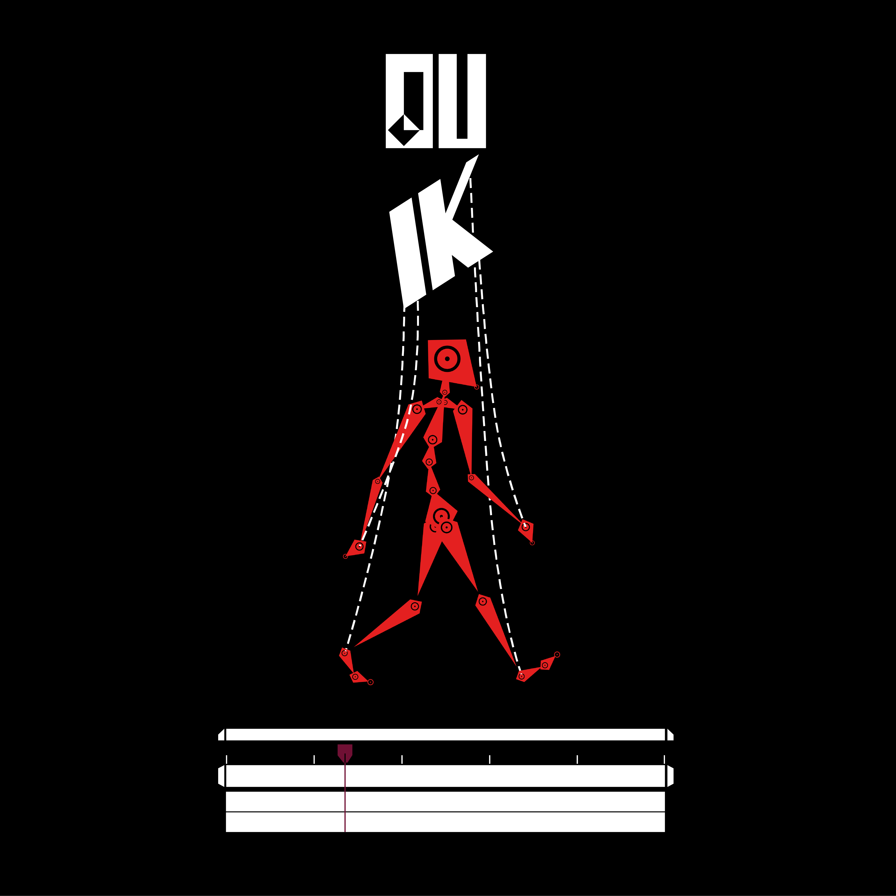
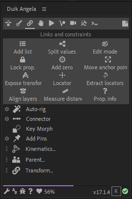
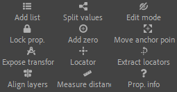

#  Links and Constraints

The core of a rig are the links and constraints between the bones, the layers or the properties. You can view the constraints as the strings and mechanisms which drive a puppet; the [bones](../bones/index.md) are the armature, the handles are the animation [controllers](../controllers/index.md).

{style="max-width:600px;"}

There are several different kinds of constraints, but they almost all work the same way, in a cause-and-consequence / parent-and-child / master-and-slave relationship.

## The Links and Constraints panel

  
*The Links and Constraints panel*

The top toolbar of the Links and Constraints panel contains a few useful tools related to parenting, properties and transformations. Below the toolbar, you'll find all the available constraints.

  
*The Links and Constraints toolbar*

### Contents

- [Auto-rig](../bones/autorig/index.md)
- [Connector](connector.md)
- [Key Morph](key-morph.md)
- [Pins](pins.md)
- [Kinematics (IK and FK)](kinematics.md)
- [Parenting](parent.md)
- [Transform Constraints](transform.md)
- Tools
    - [Add list](tools/list.md)
    - [Split values](tools/split.md)
    - [Edit mode](tools/edit-mode.md)
    - [Lock property](tools/lock.md)
    - [Add zero](tools/zero.md)
    - [Move anchor point](tools/anchor.md)
    - [Expose transform](tools/etm.md)
    - [Locators](tools/locator.md)
    - [Align layers](tools/align.md)
    - [Measure distance](tools/measure.md)
    - [Property info](tools/prop-info.md)
    - [Locator](tools/locator.md)
