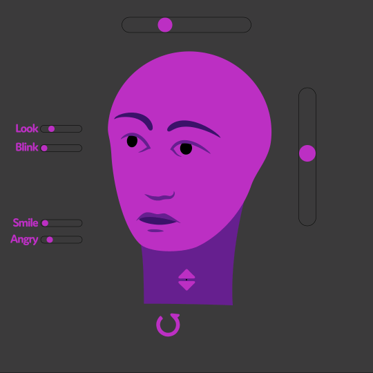
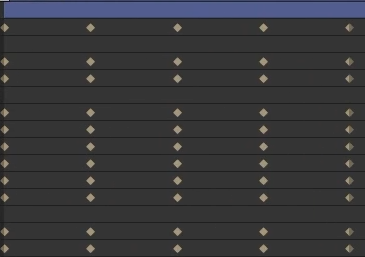
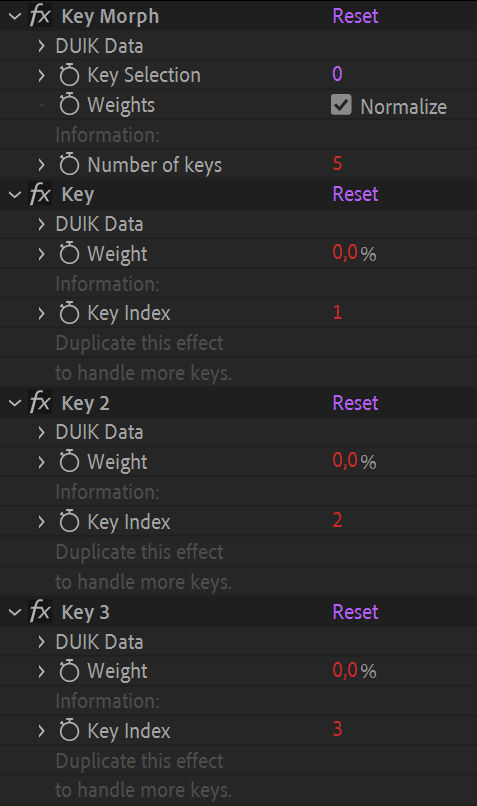
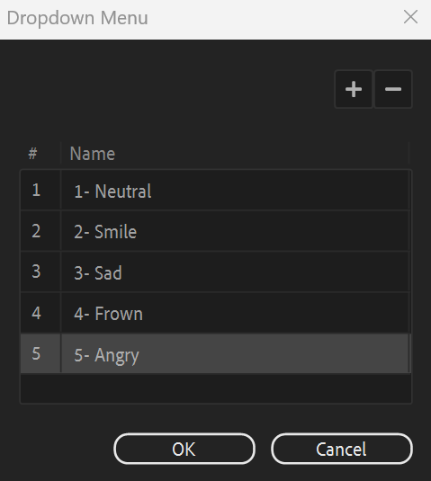

# {style="width:1em;"} Key Morph

  
*This video is part of [__the official comprehensive video course about Duik Ángela__](https://rxlaboratory.org/product/the-official-comprehensive-video-course-about-duik-angela/)*

The key morph is simple yet very powerful and versatile interpolation tool. It is able to morph between key poses or blend them together[^1] using any property in After Effects (as long as it can be controlled by an expression). This is especially useful to control facial expressions (emotions and expressions, head turn, lipsync...), or any other animation based on specific poses (e.g. complex hand shapes).

To setup the key morph, the first step is to **create the actual key poses**, by just **adding the needed keyframes on the properties** which make the pose.

The first keyframe needs to be the *neutral* pose, from which other poses will be interpolated (front facing for a turn, neutral emotion when preparing facial expressions, etc.).

  
*Keyframes ready to be controlled by the* Key Morph.  
*Note that the keyframes could spread across multiple layers too.*

All the properties to be controlled need to have the same count of keyframes; you may copy and paste the first keyframe to complete the set of keyframe if needed.

From this kind of keyframe set, the key morph adds simple controllers to either interpolate between arbitrary key poses (it is able to interpolate from the first to the fourth without going through the second and third), or blend these key poses together according to an arbitrary ratio you can animate.  
Just **select all the keyframes** and **click the {style="width:1em;"} *Key Morph* button**.

Duik adds a bunch of effects on the layer.

  
*The* Key Morph *effects.*

There are two ways of using the keymorph:

- **Interpolate** between key poses.  
  For example to animate the mouth during a dialog (that's called lipsyncing). In this case, you just want to select a phoneme at the right time **one after each other**, and interpolate between them but don't need to blend them together.
- **Blend** different poses.
  For example to animate facial expressions, you may need to turn the head a bit, open the mouth, show a smile, raise the eyebrows, all **at the same time**.

  
*This video is part of [__the official comprehensive video course about Duik Ángela__](https://rxlaboratory.org/product/the-official-comprehensive-video-course-about-duik-angela/)*

## Interpolate between key poses

You can easily interpolate between key poses with the default setup, using the first *Key Morph* effect:

1. Keep the ***Weights* normalized**.  
    This makes sure there's no extrapolation and the poses will interpolate smoothly.
2. __Animate the *Key Selection*__ property.  
    Each pose is numbered from `1` to the number of poses. Don't use `0`, the first and neutral pose is the number `1`.

With a lot of key poses it may be difficult to remember the number associated with each pose (the *index*); in this case you could easily improve a bit the default key morph setup.

### Use markers.  

You could add a marker for each pose to keep track of what they are, including their index.  

To add a marker, select the layer and press the `[*]` key. You can then double click the new marker to add a comment.

### Use the connector to control the key morph with a better controller

For example, using a dropdown menu is very handy in most cases

1. Create a Dropdown menu control  
    Edit it to list the poses.  
    
2. Connect it to the key poses using the *{style="width:1em;"} [Connector](connector.md)*[^2]  
    1. Select the new dropdown effect (the property in the timeline, not the effect itself).  
    2. In the connector additional panel, click the *{style="width:1em;"} Pick Property* button.  
    3. Select the *Key* effects to be connected, on the layer with the key morph setup.  
    4. In the connector additional panel, click the *{style="width:1em;"} Pick Property* button.

You can now simply animate this effect to interpolate between the key poses.

## Blend multiple key poses

To be able to blend multiple key poses, first adjust these settings on the first *Key Morph* effect on the layer:

- **Set the *Key Selection* to `0`** to disable it.
- **Uncheck the *Normalize* checkbox** for the *Weights* to be able to extrapolate and blend multiple poses together.

You can now just animate the *Weight* percentage value for each *Key* effect on the layer. Duik will nicely blend the poses together, and you can blend as many poses as you wish.

!!! tip
    The *Weight* value is not bound between `0 %` and `100 %` to let you easily reverse or extrapolate each pose.

!!! tip
    You can use expressions or connect the *Weight* properties of the keys to customized controllers, like Duik [Sliders](../controllers/index.md) or expression control effects, to control them from another composition and controller layer for example.

## Edit Key Poses

After the Key Morph creation, you can still edit, add or remove key poses.

1. Deactivate the expressions in the properties you need to edit.
2. Edit the keyframes; you can also add or remove key poses.
3. If you've removed some key poses, delete some *Key* effects so there's the same count as the poses.  
    If you've created new key poses, duplicate the last *Key* effect to have the same count as the poses.

[^1]: This is a very common technique in 3D software. It's called *Shape Keys* in *Blender*, *Pose Morph* in *Cinema 4D*, *Blend Shapes* in *Maya*, *Morpher* in *3DS Max*... 