# {style="width:1em;"} Inverse and Forward Kinematics (IK / FK)

*Kinematics*[*](../../misc/glossary.md) in rigging and animation describe several methods to control and animate the rotation and location of the joints of limbs (i.e. Kinematic Chains[*](../../misc/glossary.md)).

{style="max-height:720px;"}  
*Illustration of mechanical arm; Instrumenta chyrurgiae et icones anathomicae  
Ambroise Paré, 1564  
[CC BY 4.0](https://creativecommons.org/licenses/by/4.0/deed.en){target="_blank"}, [Wellcome Library](http://wellcomeimages.org/), London.*{style="font-size:0.8em;"}

Usually, the most basic rig for any kind of limb is to parent the layers together, from the tip (child, e.g. hand or foot) to the root (parent, e.g. shoulder or hip) of the limb.  
In this simple case, that's called ***Forward Kinematics (FK)***[*](../../misc/glossary.md): you just need to animate the rotation of each joint from the root to the tip to animate the whole limb.  
This is the easiest way to animate a limb, as rotation are simple values, and you just have a single value per joint to animate. This works as long as there is no interaction and constraint between the tip (e.g. hand or foot) with something else which moves differently (or is just static, like the floor in the case of a foot).

But if you need to constrain the tip of the limb, or just keep it static while animating the root (e.g. keep the foot still on the ground while moving the hips around), you'll need another method where you can animate both ends of the limb using their position instead of their rotation. That's called ***Inverse Kinematics (IK)***[*](../../misc/glossary.md), because to the contrary of the FK, you have to animate the end of the limb and the position value is then automatically converted to rotation values in the reversed order, from the tip to the root of the limb. This makes it a bit more difficult to achieve a nice animation, as you'll have to take care of the trajectories of the end of the limb, and handle position properties which are multi-dimensional and more complex than simple rotations.

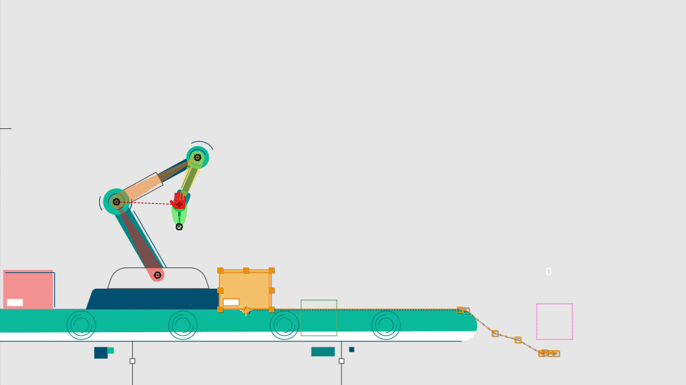  
*Claude Autret "Jissse"  
All rights reserved*{style="font-size:0.8em;"}

!!! note
    When animating using IK, you have to set the values of the position keyframe and their temporal interpolation, as you would with FK and rotations, but you also have to manage the spatial interpolation and make sure the limb always follows a curved trajectory (and not straight lines)[^1].

With Duik (and the Auto-rig) you can rig limbs in a way to be able to switch at any time between IK and FK according to your needs at the time you're animating. There are also specific types of IK to ease the animations of longer limbs like horse legs, ant and crab legs or even like hair strands, tails or even spines and long necks.

## IK and FK creation

There are two ways to rig After Effects layers with the different types of Duik IK and FK controls:

- Using Duik [bones](../bones/index.md) and the [Auto-rig](../bones/autorig/index.md)&nbsp;[^2].
- Using the {style="width:1em;"} *Kinematics* menu in the *{style="width:1em;"} Constraints* panel. Using this method, you'll be able to rig any kind of layer.

Both methods allow you to customize the type of IK/FK controls which are created by Duik.

Duik creates one or several controller layers, according to the type of IK/FK, and adds a few effects on these controllers to adjust the settings and give a more precise control on the limb.

### Using the Auto-Rig

Although the Auto-Rig is a smart tool and will try to do its best no matter what layer you select, it's better to use it exclusively with Duik bones.

1. Select the bone layers you want to rig.
2. Click the *{style="width:1em;"} Auto-Rig* button. This button is available in the {style="width:1em;"} *Meta-Rig*, {style="width:1em;"} *Bones* and {style="width:1em;"} *Links and Constraints* panels.

When using custom bones and for other specific long chains like tails or hair strands, you can choose the type of FK or IK control to use. Read the *[Bones and Auto-Rig / Auto-Rig](../bones/autorig/index.md)* section for more details.

### Using the Kinematics menu

This method works with all layers.

1. Parent the layers together, from the tip (child) to the root (parent) of the limb.
2. Create a controller layer[^3] if you'd like to use a custom controller. This is optional as Duik will create a controller for you if there's no controller already available.
3. Click the {style="width:1em;"} *Kinematics* menu and then click the type of IK or FK Control you'd like to use.

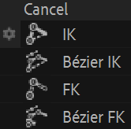  
*Different types of IK and FK controls are available.*

This menu shows the different types of IK and FK Control:

- **Standard IK/FK**  
    This is suitable for single-layer, 2-layer and 3-layer chains; some options are available specifically for 3-layer chains, read below for more details.
- **Bézier IK**  
    Although the Bézier IK can be used for any layer chain, it is especially useful for chains longer than 2 layers.
- **FK** with Overlapping animation
    This is a very handy FK-only control for chains where you're sure you won't need IK.
- **Bézier FK**  
    This is a special control based on the Bézier IK control but rigged in a way you can animate rotations instead of the Bézier IK controllers' positions.

## Standard IK/FK

The standard IK and FK control can be used with chains consisiting of one to three layers (plus the tip, like the hand or the foot). It can be used for almost all kind of legs and arms.

  
*This video is part of [__the official comprehensive video course about Duik Ángela__](https://rxlaboratory.org/product/the-official-comprehensive-video-course-about-duik-angela/)*

### Single-layer chain

When used on a single layer, the rigged layer just automatically rotates to always point towards its controller.

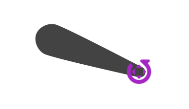

With this type of IK/FK, you can animate either the position of the controller and the position of the rigged layer (or its parent), or the rotation of the layer itself. This means you can animate both using IK or FK as you wish.  
If there was a tip layer (e.g. hand, foot...) when rigging the layers, it can be rotated using the controller's rotation property.

The effect on the controller allows you to customize the control.

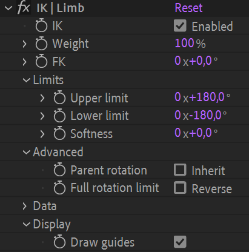

- ***IK***: you can disable the IK if needed; this is animatable.
- ***Weight***: if you set this to a lower value than `100 %`, the layer will rotate less than needed to point towards the controller.  
    This is how Duik rigs the automatic rotation of the shoulder when you move the hand for example.
- ***FK***: use this value to control the rotation of the rigged layer.  
    This is here for convenience, as you could also just animate the actual rotation of the layer.
- The ***Limits*** define bounds for the rotation of the layer.  
    This may be useful to limit the rotation of a shoulder in its natural bounds for example. To help you define these limits, you can use the guides to visualize them.
- ***Advanced***:  
    - ***Inherit parent rotation***: if this is checked, the layer will rotate with its parent rotation.  
        Disabling it makes sure the layer always keeps its own orientation no matter the rotation of its ancestors.
    - ***Full rotation limit***: at some point when you move the controller around, there will be a 360° jump in the rotation values of the layer.  
        Check this to set this jump on the other side, 180° above.
- The ***Data*** section contains some data needed by Duik to compute the Kinematics.
- ***Display***:  
    - ***Draw guides***: check this if the controller is a shape layer to show some useful guides to setup the IK.
        The limits will be shown to help you adjust their values.

  
*The IK Controller with the guides, showing the limits, and the* full rotation limit *in red.*

### 2-layer chain

With two layers, both layer rotations are automated to form a triangle between the two joints and the controller; this is very natural for arms and legs.

When animating the position of the controller or the position of the first layer (or any of its parents), the limb rotates and bends automatically. With this IK setup, Duik also controls the position of the limbs to be able to stretch (or shrink) them, and allow for fore-shortening effects for example.  
If there was a tip layer (e.g. hand, foot...) when rigging the layers, it can be rotated using the controller's rotation property.

Duik also includes nice automations to help the animation using FK and make it even simpler and quicker, although it's already much simpler than IK animation.

All this can be configured and animated in the effect of the controller.

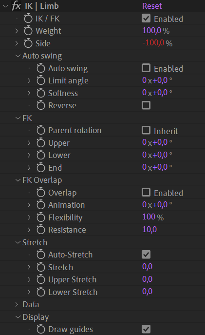

- ***IK / FK***: you can disable the IK if you need to animate using FK; this is animatable.
- ***Weight***: this blends the IK and FK animation, allowing for a smooth transition between the two.  
    Setting `0 %` actually deactivates the IK.
- ***Side***: the side of the joint (e.g. elbow or knee) can be controlled with this value.  
    `100 %` is on one side, `-100 %` is the other side. Values in between allow for a smooth transition, to animate a foreshortening or fake 3D rotation of the limb.
- ***Auto swing*** changes the side automatically according to a specific angle.  
    To help you set the limit precisely, you can use the guides to visualize it.
- ***FK***:  
    To animate using FK, you need to disable the IK (or set the weight to `0 %`) first.  
    You can then animate these rotation values to animate the limb using FK.  
    - ***Parent rotation***: if this is checked, the limb will rotate with its parent rotation.  
        Disabling it makes sure the limb always keep its own orientation no matter the rotation of its ancestors.
    - ***Upper*** is the rotation of the first layer (the root, e.g. the thigh)
    - ***Lower*** is the rotation of the second layer (e.g. the calf)
    - ***End*** is the rotation of the layer at the end (e.g. the foot), if any.  
        This layer is not actually a part of the IK/FK setup, but it's useful to be able to animate it right from this effect.
- ***FK Overlap***:
    Instead of animating the two or three FK rotation values manually, this FK with automatic overlapping animation[*](../../misc/glossary.md) may help you animate the whole limb with a single value.
    - ***Overlap***: check this to enable the automatic overlapping animation.
    - ***Animation*** is the property you can animate to automatically animate the whole limb.  
        This works especially well to animate the arm swinging during a walk cycle for example.
    - ***Flexibility*** adjusts the quantity of overlapping animation. It is an arbitrary value.
    - ***Resistance*** adjusts the delay between the rotation of each part of the limb. It is an arbitrary value.
- ***Stretch***:
    - ***Auto-Stretch*** makes the limb stretch[*](../../misc/glossary.md) if it's too short to reach the location of the controller.
    - ***Stretch*** stretches both the first and second layer of the limb, keeping their relative lengths.
    - ***Upper stretch*** stretches the first layer (e.g. the thigh).
    - ***Lower stretch*** stretches the second layer (e.g. the calf).
- The ***Data*** section contains some data needed by Duik to compute the Kinematics.
- ***Display***:  
    - ***Draw guides***: check this if the controller is a shape layer to show some useful guides to setup the IK.
        The Auto swing limit will be shown to help you adjust its values.

!!! tip
    The data section of the effect exposes useful values to write your own expressions or to be used with the connector for an advanced and more customized rig.

!!! tip
    You can easily switch between IK and FK animation using the [IK/FK Switch](../animation/tools/ik-fk-switch.md)&nbsp;[^4] tool in the [animation panel](../animation/index.md).

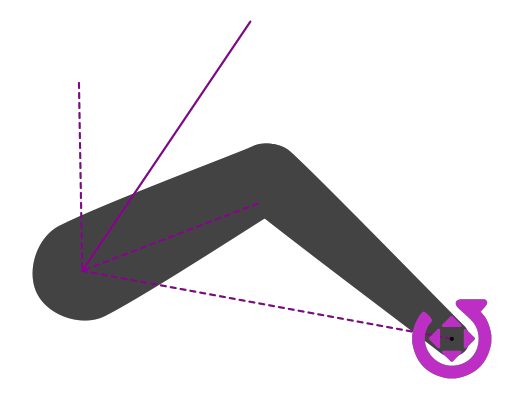  
*The IK Controller with the guides, showing the auto swing limit.*

### 3-layer chain

Rigging a limb with three joints (and more) is more complicated than it seems. In two dimensions with only two joints, there are only two solutions to the equation defining the rotations of each part (the middle joint, the elbow or knee, can only be on one of the two sides of the line passing through the first joint and the controller). But with three joints, there's an infinity of solutions.

Apart from this difficulty, if we'd use standard IK for the three joints without more details, that'd mean the animator would not be able to manually adjust each joint if needed. Rigging should ease the life of animators, but never restrain their job.

These are the reason why Duik does not include true 3-layer IK, but is able to rig 3-layer chains with better controls and accuracy, combining standard 1-layer and 2-layer IK.

There are two possibilities: rigging the first layer with a 1-layer IK and the next two layers with a standard 2-layer IK, or the opposite, starting with the 2-layer IK for the first two layers. With both methods, Duik creates a single controller for both the IK controls, allowing for a very simple animation with just the position of the controller, and all detailed controls gathered in the effects of the controller.  
You can choose between the two in the additional panel of the *{style="width:1em;"} IK* button.

- ***2+1-layer IK*** creates a single-layer IK on the first layer and 2-layer IK on second and third layers.  
    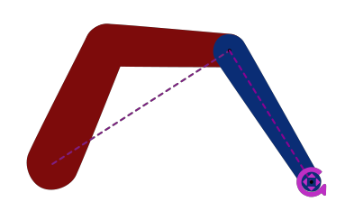  
    This mode works best with crab legs for example, when the rotation of the last layer must be controlled precisely.  
    Animate the position of the controller to animate the whole limb, and its rotation to control the orientation of the last layer (in blue).
- ***1+2-layer IK*** creates a 2-layer IK on the first and second layers and a single-layer IK on the third.  
    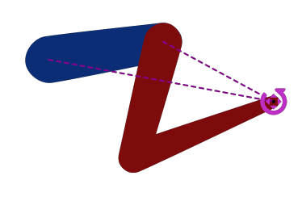  
    This mode works best with arms and their shoulders for example, where the rotation of the first layer must be controlled separately from the other layers, but can be automated with the 1-layer IK weight.  
    Animate the position of the controller to animate the whole limb, and use the single-layer IK weight to adjust the automatic rotation of the first layer (in blue), or animate its FK value to rotate it manually.

{style="max-height:720px;"}  
*Figure 21 from The Kinematics of Machinery.  
Franz Reuleaux, 1876  
Public domain*{style="font-size:0.8em;"}

## Bézier IK

Bone chains with more than two or three bones are usually used to rig flexible limbs, like tails, spines, long necks or hair strands. In this case, the chain is not animated with separated joints, but all at once as a long curve. There are two options to animate this:

- Using **FK**, which is best if the limb is something just hanging (like hair strands or cloth, and tails), attached only on one side.
- **Bézier IK**, which is a special kind of IK you can control with several controllers to define the curve of the limb, as you would for a Bézier path using points and tangents.  
  This is best if the chain is interacting with something else (attached) on both sides, like the spine, the neck, or the tail of the dog stucked in a door. Ouch.

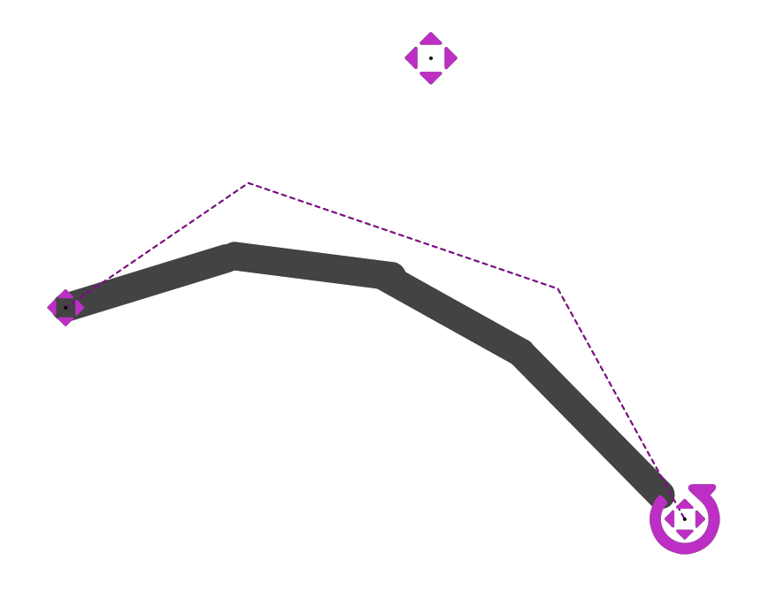  
*Four layers controlled with Bézier IK*

Three controllers are available to animate the limb with Bézier IK:

- A *Root* position controller can be used to move the root of the limb.  
  It is usually parented to the rest of the body (the hips for a tail, the head for hairs, etc.)
- At the middle, a *Curve* controller helps you animate the curvature of the limb, using its position value.
- At the end, the actual IK controller, to move the tip of the limb.

There are two effects to adjust some details:

- On the controller of the end of the limb (the main controller):  
    
    - By default, the layers are aligned on the virtual curve (tangent to the curve). You can uncheck the ***Auto orient*** option to animate their rotation manually.
    - Use the ***Offset*** to move the layers along the virtual curve. Note that this option is also **availabe on each layer individually**.
- On the *Curve* controller:  
     
    - Uncheck the ***Draw guides*** option to hide the dashed line representing the IK.
    - You can check the ***Show handles*** option to display secondary controls to adjust the virtual curve more precisely.

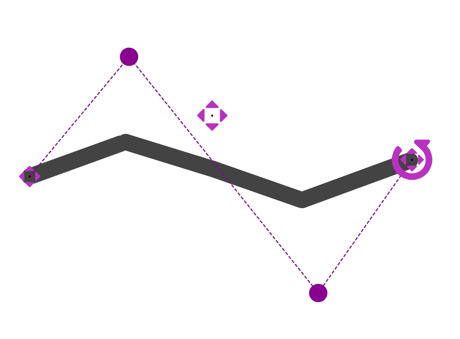  
*When showning the curve handles, you can adjust the virtual Bézier curve very precisely.  
Double click on the handle to move it around.*

The optional Bézier handles are actually groups in the shape layer content of the *Curve* controller; to animate them, animate the position of these groups.

## FK with overlapping animation

The FK rig is a very simple controller to control all the rotations of a long (or short) chain of bones, either individually or all at once. It was especially made to easily animate tails, cloth, hair strands, scarfs, etc.

When animating the whole limb at once with a single value, Duik can automatically handle the detailed animation for you, with an automatic overlapping animation, completely customizable.

  
*Claude Autret "Jissse"  
All rights reserved*{style="font-size:0.8em;"}  
*Fish tails are rigged with the FK controls and automatic overlapping animation.*

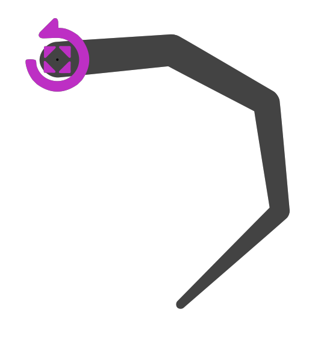  
*Four layers controlled at once with the FK control.*

To animate the limb, you can just **animate the rotation of the controller**.

!!! tip
    When adjusting the **start pose of the animation**, **adding the first keyframe on the rotation** of the controller, **you'll also need to adjust the *Angle* value of the second layer** of the chain (in the controller's effects), to fix the pose. That's because of the automatic overlapping animation, which can't control the first pose as it needs animation data to process the angles, and there's no animation before the first keyframe.

    For performance reasons, Duik also ignores all keyframes hidden before the start of the composition.

To adjust the settings of the automatic overlapping animation, an *FK Overlap* effect is available on the controller.

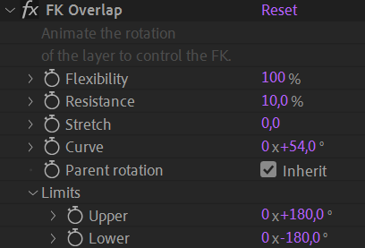

- The ***Flexibility*** adjusts the amplitude of the movement of each individual layer in the chain.
- The ***Resistance*** adjusts the time of the overlap. For example, the value will be higher in the water than in the air.
- You can use the ***Stretch*** to adjust the length of the limb. This works well if the layers are linked to puppet pins (using [bones](../bones/index.md) and/or Duik [pins](pins.md)).
- Use the ***Curve*** value to adjust the global curvature of the limb. This value should not be animated (use the rotation of the controller for the animation).
- If the ***Parent rotation*** is checked, the limb will rotate with its parent rotation. Use this for a tail for example.  
    Disabling it makes sure the limb always keep its own orientation no matter the rotation of its ancestors. You can use this for a scarf or hair strand for example, so it stays vertical no matter the rotation of the head.
- You can set ***limits*** to bound the rotation of each individual part. This is useful for limbs with a high flexibility or resistance.

Finally, one angle control is added for each layer of the controlled chain to allow you to adjust and animate each part individually, like in all standard FK rig.

## Bézier FK

The Bézier FK is a specific setup using the standard Bézier IK as a base and some simple expressions and parenting to be able to animate both using *fake* FK and Bézier IK at the same time. This is very useful to animate spines or necks, or any chain which itself has children (like the head for the neck) and when you may need both FK for most of the animation and IK in specific cases.

  
*Four layers controlled using Bézier FK*

With this Bézier FK, you have **the exact same controls as with Bézier IK** (animate the position of the controllers, controlling the curvature with the controller at the center of the chain), but **you can also animate the rotation of the controllers**, as you would when using standard FK.  
In this case, Duik moves the *curve* controller automatically, and you can adjust this automation using the ***Auto-Curve*** effect on the controller at the end of the limb.

[^1]: As the movement of the hand or the foot are actually the result of the rotation of the elbow and shoulder or the knee and hip, they naturally move following smooth curves. That's not the case by default when animating positions in After Effects, where the trajectory will be a straight line. When animating with IK you'll have to use the pen tool to adjust the spatial Bézier interpolation of the position keyframes if you don't separate the dimensions and handle manually the individual interpolations for each axis.

[^2]: *cf.* *[Bones and Auto-Rig](../bones/index.md)*

[^3]: *cf.* *[Controllers](../controllers/index.md)*

[^4]: *cf.* *[Animation / Tools / IK/FK Switch](../animation/tools/ik-fk-switch.md)*
