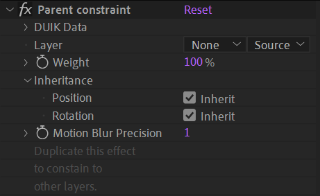

# {style="width:1em;"} Parent Constraints

With a few parenting[*](../../misc/glossary.md) tools and constraints, Duik can improve the concept of layer parenting in After Effects.

With the **parent constraint**, you can animate and weigh[*](../../misc/glossary.md) the link between layers; you can also **parent layers across (pre)compositions**, and **quickly parent selected layers** together.

{style="max-height:720px;"}  
*Artificial limbs  
Ambroise Paré, 1585  
[CC BY 4.0](https://creativecommons.org/licenses/by/4.0/deed.en){target="_blank"}, [Wellcome Library](http://wellcomeimages.org/), London.*{style="font-size:0.8em;"}

Select the layers, then click the {style="width:1em;"} ***Parent*** button to select the constraint to apply to the selection.

## {style="width:1em;"} Auto-Parent

Auto-parent is a quick way to parent the selected layers. It is very handy with compositions with a lot of layers; instead of using the After Effects pickwhip or scrolling through a too-long list of layers, click this button to parent all selected layers to the last-selected one.

1. Select the child layers.
2. Add the parent to the selection.
3. Click the {style="width:1em;"} *Auto-Parent* button to parent the children to the parent.  
    - `[Alt] + [Click]` to parent only the orphans (the layer which don't have no parent yet).
    - `[Ctrl] + [Click]` to parent the selected layers as a chain[*](../../misc/glossary.md), from ancestor to child, in the order of the selection.

!!! tip
    This feature is available as a scriptlet[^1], which makes it easy to assign a keyboard shortcut to it (like the recommended `[Ctrl] + [P]`).

## {style="width:1em;"} Parent Constraint

The Parent Constraint works like standard After Effects parenting, except that the parenting can be animated, so that a child layer can change its parent (or combine multiple parents) at any time.

1. Select the child layer.
2. Click the {style="width:1em;"} *Parent Constraint* button.
3. Select the parent layer in the *Parent Constraint* effect on the child layer.

You can use the effect to adjust and animate the parent constraint.

!!! note
    You won’t see the effect of the parent constraint unless there already are some keyframes (or expressions), the tool needs actual animation to compute the constraint.

You can select the **parent layer**, but this is not animatable. To change the parent, you have to **duplicate the effect** to have **one effect per parent**, and then animate the ***Weights*** to switch between parents, or mix them.

You can also choose to **inherit only the position** or **only the rotation**.

!!! note
    Due to After Effects limitations, child layers can't inherit the scale for now.

You can increase the ***Motion Blur Precision*** if you notice motion blur artefacts, but be careful as this may have a very bad impact on performance.

The transformation of the child layer is computed depending on the weights and the transformations of its parent layers from the beginning of the composition. When adding a new parent link, you may set a first keyframe on its weight to 0% and only raise the weight when you need the child to follow the parent.

!!! warning
    This constraint must use complex expressions, especially if you need to inherit both the position and rotation. This is a problem regarding the performance; the longer the composition, the longer the time needed to compute the expressions: you should try to use this constraint only in short compositions.

    If you can, you should use the [position or orientation constraints](transform.md)&nbsp;[^2] instead, which are much lighter, or deactivate the inheritance of the position or the rotation.

As this constraint relies on all previous movements to compute the current position and orientation of the child layer, changing any value at a specific time changes all the following values too. This is also true when moving keyframes in time. This may seem counter-intuitive, compared to the standard After Effects parenting, where you don't have to worry before changing a parent, because without parenting animation, After Effects can instantly adjust the values for all the times. That's not possible if what you need is precisely to animate this parenting like with the Duik Parent Constraint.

To ease the animation of the parent constraint, it's better to always animate following the time of the composition, and try to never add, move or edit keyframes *before* existing keyframes.

Most of the time, it's also easier to animate the weight using the *Hold* interpolation, and setting either `0 %` or `100 %` only.

!!! tip
    You may have trouble to *unparent* the constrained layer during the animation. Instead, you can create a null layer and parent the constrained layer to it; this will fix any issue you may have when all weights are set to `0 %`.

## {style="width:1em;"} Parent across compositions

[^1]: *cf.* *[Getting Started / Installation](../../getting-started/install.md)* and *[Advanced / The Duik API / Keyboard Shortcuts](../../advanced/api/shortcuts.md)*.

[^2]: *cf.* *[Constraints / Transform](transform.md)*