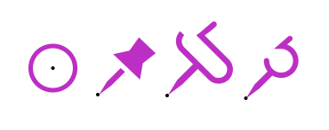
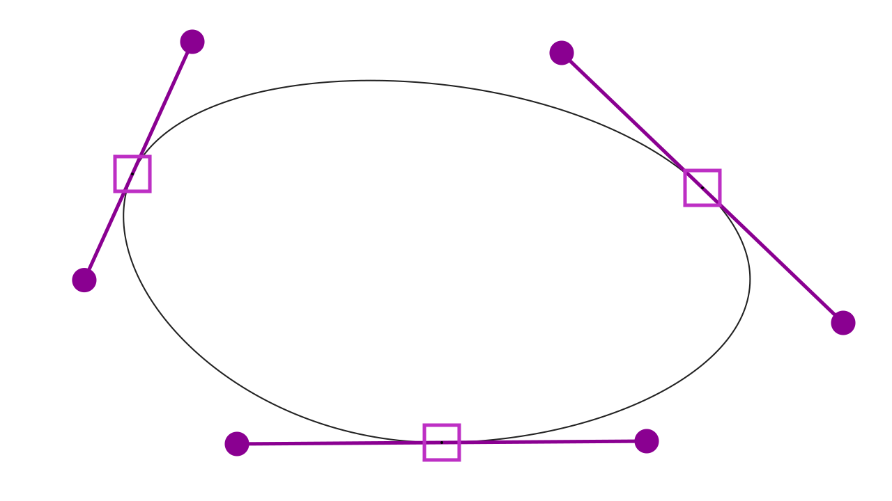
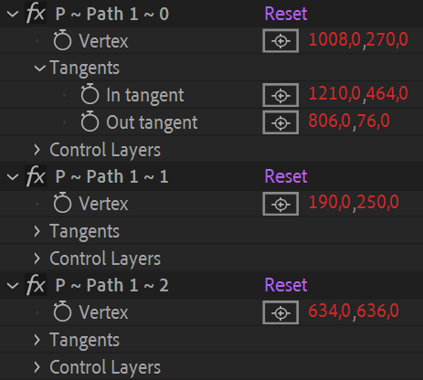
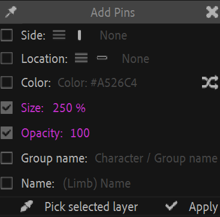

# {style="width:1em;"} Pins

*Pins* are a very simple yet extremely useful tool. They are layers used to control any spatial property or Bézier shape. This is a quick way to parent these properties or any vertex of a Bézier path to any other layer for example.

Duik *Pins* are the easiest way to rig a character using the After Effects Puppet tool or Bézier paths; you'll just need to add Duik pins to the puppet pins or Bézier paths, and parent them to the armatures like you would for any other layer.

## Creation

1. **Select** the properties.
2. **Click** on the *{style="width:1em;"} Add Pins* button.  
    - Maintaining the `[Alt]` key will create controls for the tangents when adding pins on a Bézier path.

## Spatial properties and puppet pins

  
*This video is part of [__the official comprehensive video course about Duik Ángela__](https://rxlaboratory.org/product/the-official-comprehensive-video-course-about-duik-angela/)*

You can control any spatial (multi-dimensional) property with pins, and all types of puppet pins.

  
*Pins to control: standard spatial property, Puppet position pin, Puppet Advanced pin, Puppet bend pin.*

Standard pins and Puppet position pins control the location of the property they're linked to; Puppet bend pins control the rotation; Puppet advanced pins also control the rotation and the scale of the After Effects puppet pin.

!!! tip
    To parent a (2D) spatial property using a pin to a 3D layer, simply switch the pin to 3D.

## Bézier paths

  
*This video is part of [__the official comprehensive video course about Duik Ángela__](https://rxlaboratory.org/product/the-official-comprehensive-video-course-about-duik-angela/)*

You can use Duik pins to control all Bézier paths (masks or shape layers).

  
*A Bézier path controlled with Duik pins.*

By default, Duik won't create pins to control the tangents, but **the tangents can still be controlled by rotating and scaling the pins** for the main points.  
You can hold the `[Alt]` key when click the *{style="width:1em;"} Add Pins* button to force Duik to create layers for the tangents instead. These layers are still parented to the main points, so rotating and scaling them still works.  
By default, these tangents are locked together, but they can be unlocked with a checkbox control in the main point effects.

Bézier path pins and tangent pins can be removed or re-created at any time; this is a way to make the composition lighter with less layers, by using only the needed pins and tangent pins.  
To re-create a pin for an already rigged Bézier path, select the corresponding property in the effects of the layer containing the Bézier path, then click again on the *{style="width:1em;"} Add Pins* button.

  
*The effects on the layer containing a rigged path allow you to easily re-create missing pins to control the path, or manually adjust the values.*

!!! warning
    It seems that expressions in the Bézier path properties of masks are much slower than in path properties of shape layers. If you plan to add pins on a Bézier path, prefer using shape layers whenever possible.

## Edit pins

An effect on each pin can be used to adjust their appearance.

  
*An effect to control the pin appearance.*

You can also change the settings of multiple pins together using the additional panel of the *{style="width:1em;"} Add Pins* button.

  
*Edit multiple pins using the additional panel.*

