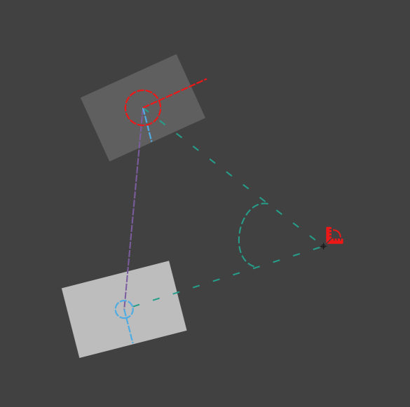
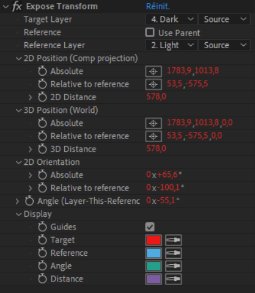
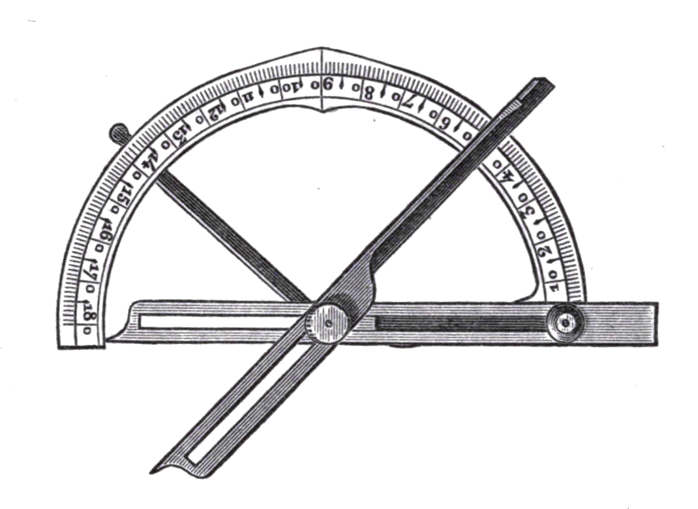

# {style="width:1em;"} Expose Transform

The “*Expose Transform*” is an object (a controller) which will measure and **expose angles, orientations, coordinates and distances between two layers**, which can be used as a master property with the [*Connector*](../connector.md)&nbsp;[^1] or in your own expressions.

Like any [*Controller*](../../controllers/index.md)&nbsp;[^2], you just have to click on the {style="width:1em;"} *Expose Transform* button to create it. If a layer was previously selected, the Expose Transform object will be created at the same location and will get the name of the layer.

By default, it will measure the transformations of the selected layer, and any relative coordinate will be measured relatively to the parent of the layer.

Values and measurements are exposed in the effect on the controller layer.

You can change the measured layers with the first parameters of the effect.

- The *Target Layer* is the one which transformations are exposed.
- You can uncheck the *Use Parent* checkbox to measure relative transformations relatively to a layer other than its parent.
- The *Reference Layer* is the reference used for all relative transformation measurements.

The effect exposes all measured values which can be used in expressions or with the [*Connector*](../connector.md)&nbsp;[^1].

{style="max-height:720px;"}  
*Contact goniometer of the Carangeot type  
Alfred Edwin Howard Tutton, 1911  
Public domain.*{style="font-size:0.8em;"}

[^1]: *cf.* [*Constraints*](../index.md) / [*Connector*](../connector.md).

[^2]: *cf.* [*Controllers*](../../controllers/index.md).

