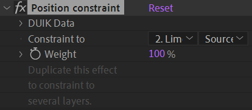
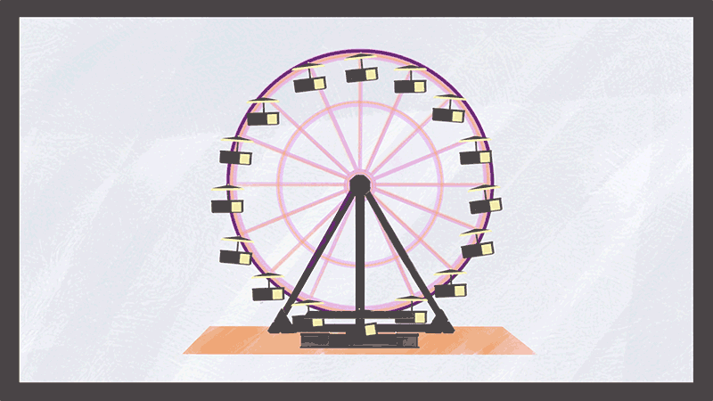
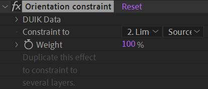

# {style="width:1em;"} Transform Constraints

Transform constraints can constrain (i.e. link) the position and rotation of a layer to follow the location and orientation of other layers and Bézier paths.

They're very useful to rig all kinds of machines, cogs, or also cloths, for example when used with puppet pins or Bézier paths and [Duik pins](pins.md)&nbsp;[^1], constrained to the orientation or location of the limbs and joints.

_(14597187638).png){style="max-height:720px;"}  
*Elementary treatise on the finishing of white, dyed, and printed cotton goods  
Joseph Depierre, 1889  
Public domain.*{style="font-size:0.8em;"}

Most of the time, the same effect can be obtained with the connector, but with un-bounded values. Using constraints is also easier when there are multiple master layers.

Select the layers to constrain then click the **{style="width:1em;"} *Transform...*** button to select the constraint to apply to the selection.

!!! tip
    When a layer is constrained, its rotation and position are not locked; you can still edit and animate them manually and offset the constrained value.

# {style="width:1em;"} Position Constraint

You can constrain the position of a layer to the location of other layers; that means the constrained layer will translate according to the absolute location of the other layers, taking all parent translations into account. The weight[*](../../misc/glossary.md) acts as a multiplier of the constraint and can be animated.  
For example, if a layer is constrained to two other layers with both weights at `50 %`, it stays in the center of the segment joining the two other layers. That also works with three layers and `33.3 %`, to attach the layer to the center of mass of the layers. Of course you can adjust the weights to change the "*mass*" of the master layers.

You can use the effect to adjust and animate the position constraint.

Just select the layer to constrain to, and set or animate its weight. To constrain to multiple layers, you can duplicate the effect.

!!! note
    Because this constraint depends on the specific location of the layers at the beginning of the composition, you won't see the effect of the position constraint until there's an actual animation (using keyframes or expressions) on the master layers, and at the very first frame of the composition.

## {style="width:1em;"} Orientation Constraint

You can constrain the rotation of a layer to the orientation of other layers; that means the constrained layer will rotate according to the absolute orientation of the other layers, taking all parent rotations into account. The weight[*](../../misc/glossary.md) acts as a multiplier of the constraint and can be animated.

  
*Léa Saint-Raymond  
All rights reserved.*{style="font-size:0.8em;"}

This is a very useful tool when you need a layer to stay always aligned with another layer, without translating with it.  
You can also use this constraint to link the orientation of a controller to the orientation of any layer in the rig, this is a quick and easy way to control rotations in a rig, without parenting.

You can use the effect to adjust and animate the orientation constraint.

Just select the layer to constrain to, and set or animate its weight. To constrain to multiple layers, you can duplicate the effect.

!!! tip
    When all orientation constraints are set to `0 %`, the constrained layer keeps its own orientation no matter what, even if it has a parent. That's an easy way to rig the gondolas of a ferris wheel for example, or the pedal of a bicycle.

## {style="width:1em;"} Path Constraint

To make a layer follow a Bézier path (and stay aligned with it), you can use the path constraint. It constrains both the position and the rotation of the layer.

_(14597187638)_2.png){style="max-height:720px;"}  
*Elementary treatise on the finishing of white, dyed, and printed cotton goods  
Joseph Depierre, 1889  
Public domain.*{style="font-size:0.8em;"}

1. Click the {style="width:1em;"} ***Path Constraint*** button.  
    
2. **Select the path** property (be careful not to select the group containing the path, but the actual path property).
3. **Click the {style="width:1em;"} eye dropper** button.  
    
4. **Select the layer** to constrain.
5.  **Click the {style="width:1em;"} Path constraint** button.  
    You can `[Alt] + [Click]` to automatically move the constrained layer to the first point of the path.

You can use the effect to adjust and animate the path constraint.

- You can **move the layer along the path** with the first percent value; you can easily loop the animation as this value is not limited to `0 - 100 %`.
- You can offset the layer away from the path, along the normal at the corresponding percent along path, with the **Path Offset** property.
- By default, the layer is rotated to stay tangent to the path. Uncheck the **Orientation** option to disable this.

!!! tip
    If the path itself is animated, the constrained layer will follow the animation of the path, even when the *percent along path* is animated.

_(14780753041).png){style="max-height:720px;"}  
*Elementary treatise on the finishing of white, dyed, and printed cotton goods  
Joseph Depierre, 1889  
Public domain.*{style="font-size:0.8em;"}

[^1]: *cf.* *[Constraints](index.md) / [Pins](pins.md)*.