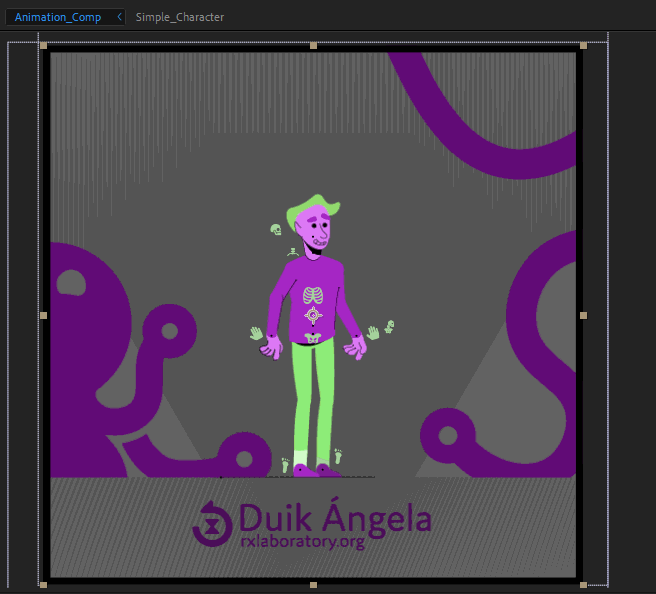

#  Controllers ▹ Extract

Extracts all controllers from the selected precomposition, to allow the animator to manipulate the rig directly from the containing composition.

In most cases, it is easier to have rigs (for characters or other items) in their own precompositions, but this is not the most handy way to animate, especially when you have several characters in the same shot or if you need to see the background.

To avoid assembling all the rigs and the background in the same composition, you can keep the rigs in a precomposition and *Extract* the controllers. This way, all the controllers are available in the same main composition, with the background if you wish, but the rigs stay precomposed. This is especially useful when there are a lot of layers for the rigs, and if you want to render proxies for character animations in order to improve performance when compositing the shot.

All controllers are parented to the precomposition, which makes it easy to move the rig; the precomposition can even be rotated and scaled too.

!!! note
    You can flip the character with a negative scale value on the horizontal axis.

## Usage

1. **Select** the precomposition.
2. **Click** the *Extract* button in the [*Controllers panel*](index.md).

!!! hint
    All layers [*tagged*](tools/tag.md) as controllers will be extracted: you can [tag](tools/tag.md) your own layers to extract them along with the controllers actually created by Duik.

## Options

You can choose to extract controllers using expressions or *Essential Properties*.

- **With expressions**, **the performance is much better**, but the precomposed rig can't be re-used in another composition. You must keep a clean copy of the rig to be able to duplicate it each time you need to animate in a new composition and extract the controllers.
- **With essential properties**, there's no need to keep a copy of the rigged composition: **the same composition can be used as many times as you need** in the same project, but the performance is worse, and may even be extremely slow.

By default, Duik will [*bake the controllers*](tools/bake.md) before extracting them, to improve the performance of the rig during the animation process. This way you can keep the controllers editable in a backup copy of the rigged precomposition, to be able to edit the rig later, but automatically have the best performance when animating after the controller extraction.

## Recommended workflow

To keep the best performance possible, it's better to always extract controllers using expressions, except in specific cases when there are very few controllers to extract. The more essential properties are created, the worse the performance is.

You should always keep your rigs in their own After Effects project files, and then import them in the projects where you're animating.

As soon as you import a specific rig, you should rename its main composition and all precompositions it uses; this is the best way to make sure all composition names are unique and avoid expression errors if you need to import several times the same rig in the same After Effects projet.

Making sure that composition names are unique and that you always keep a copy of your rigs in their own projects allows you to easily and safely extract controllers using expressions. This way you won't need to use essential properties, as you could always import the rig as many times as you need it.

## Replacing an already extracted precomposition

This is the process to follow if you need to update a rig and replace a precomposition which controllers have already been extracted.

1. [__Copy__ the animation](../animation/tools/copy.md)&nbsp;[^1], or [__save__ it in the animation library](../animation/anim-library.md)&nbsp;[^2].
2. __Remove__ the old precomposition and all its controllers.
3. __Add__ the new precomposition.
4. __Extract__ its controllers.
5. [__Paste__](../animation/tools/copy.md) or [__apply__](../animation/anim-library.md) the animation you've copied or saved.

[^1]: *cf. [Animation](../animation/index.md) / Tools / [Animation Library](../animation/tools/copy.md)*.

[^2]: *cf. [Animation](../animation/index.md) / [Animation Library](../animation/anim-library.md)*.

