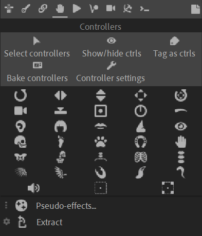
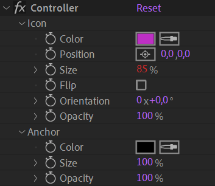

# {style="width:1em;"} Controllers

Using the [Auto-rig](../bones/autorig/index.md)&nbsp;[^1], and a set of [constraints](../constraints/index.md)[*](../../misc/glossary.md), what you end up with are *controllers*[*](../../misc/glossary.md) to drive the animation. You animate the controllers, they drive the [bones](../bones/index.md)[*](../../misc/glossary.md) through the constraints, et voilà! Your character moves.

{style="max-height:720px"}  
*Illustration of mechanical hand; Instrumenta chyrurgiae et icones anathomicae,  
Ambroise Paré, 1564   
[CC BY 4.0](https://creativecommons.org/licenses/by/4.0/deed.en){target="_blank"}, [Wellcome Library](http://wellcomeimages.org/), London.*{style="font-size:0.8em;"}

As the controllers are going to be the interface between the animator and the character, they have to be intuitive and easy to manipulate. That’s why Duik uses nice shapes to make them easier to recognize, but also adds visual feedback on the controllers to see what the controllers are doing! And of course, they can be easily customized, changing their colors and shapes if needed.

## The Controllers panel

The seven lines of icons in the center of the panel represent all the controller shapes available; they're buttons to create the controllers.

By default, controllers created by the [Auto-rig](../bones/autorig/index.md)&nbsp;[^1] and the controller panel are shape layers. This allows to customize them, and for them to be dynamic, to include guides and references with some tools. But the performance is better using raster layers or null layers; you can change the type of the controllers in the [controller settings](tools/settings.md)&nbsp;[^2].

!!! tip
    When controllers are standard shape layers (the default), you can draw anything you'd like in the content of a controller layer, therefore using custom shapes is possible.

    You can also use custom raster layers (or any layer actually); just [tag](tools/tag.md)&nbsp;[^3] your layers as controllers (and you can use them with the [Auto-rig](../bones/autorig/index.md)&nbsp;[^1]).

### Create controllers

There are several ways to create controllers:

- **Without any selection**, click one of the buttons to just create a new controller, centered in the current composition.
- **With some layers selected**:  
    - Click one of the buttons to create one controller per layer, at the same location than the corresponding layer.
    - `[Alt] + [Click]` to create a single controller for all the layers. It's created at the center of mass of the layer coordinates.
    - `[Ctrl] + [Click]` to automatically parent the layers to the new controllers. Hierarchy is kept and controllers are inserted in it; i.e. the previous parents of the layers will be the parents of the controllers.
    - `[Ctrl] + [Alt] + [Click]` to create a single controller and parent all the selected layers to it.

!!! tip
    **{style="width:1em;"} Null Controllers** and **{style="width:1em;"} After Effects Null layers** will be 3D layers if the corresponding selected layer in the composition is a 3D Layer.

If the controller is a shape layer, you can easily customize its appearance using the effect on the layer.

!!! note
    With shape layers, the size is dynamic and relative to the resolution of the composition, until the controller's been [baked](tools/bake.md)&nbsp;[^4]&nbsp;[*](../../misc/glossary.md).

To improve performance, once you've set the appearance of the controller, you can [bake](tools/bake.md)&nbsp;[^4]&nbsp;[*](../../misc/glossary.md) it.

### Specific controllers

Among all these controller shapes, some are a bit specific.

- The {style="width:1em;"} ***Slider***, {style="width:1em;"} ***2D Slider*** and {style="width:1em;"} ***Angle*** controllers are not meant to be used like other controllers - with parenting or IKs, etc. - but with the [Connector](../constraints/connector.md)&nbsp;[^5] or expressions: it is easy to get and connect their value to any other property and control almost anything you want with them, in a very visual and easy way.
- The {style="width:1em;"} ***AE Null*** button doesn't create an actual shape but an After Effects null layer to be used as any other controller.

### Tools

The toolbar at the top of the bones panel gives a quick access to several secondary but useful tools.

### Content

- [Controller Pseudo-Effects](pseudo-effects.md)
- [Extract Controllers](extract.md)
- Tools  
    - [Select controllers](tools/select.md)
    - [Show/hide controllers](tools/show-hide.md)
    - [Tag](tools/tag.md)
    - [Bake controllers](tools/bake.md)
    - [Controller settings](tools/settings.md)

[^1]: *cf.* *[Bones and Auto-Rig](../bones/index.md)* / *[Auto-Rig](../bones/autorig/index.md)*.

[^2]: *cf.* *Controllers* / *Tools* / *[Settings](tools/settings.md)*.

[^3]: *cf.* *Controllers* / *Tools* / *[Settings](tools/tag.md)*.

[^4]: *cf.* *Controllers* / *Tools* / *[Bake controllers](tools/bake.md)*.

[^5]: *cf.* *[Constraints](../constraints/index.md)* / *[Connector](../constraints/connector.md)*.
