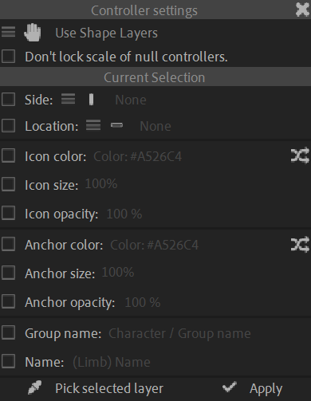
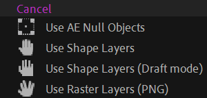

# {style="width:1em;"} Controller settings

There are four different modes to create controllers in Duik, which can be chosen on top of this panel.

***{style="width:1em;"} AE Null Objects*** and ***{style="width:1em;"} Raster Layers*** have the best performance [^1], but ***{style="width:1em;"} {style="width:1em;"} Shape Layers*** are easier to customize and include dynamic guides and references.

By default, when controllers are nulls, their scale is locked. This is optional and can be changed in this panel.

You can use the other controller settings to change the appearance of the selected controllers. The *{style="width:1em;"} Pick selected layer* button will pick all values from the selected controller to easily apply the same settings to other controllers.

[^1]: Read the [*Advanced / Performance*](../../../advanced/performance.md) section for more tips about how to improve performance in After Effects and using Duik.

