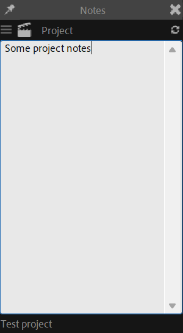

# {style="width:1em;"} Note Editor

Duik includes a simple but very useful note editor. Notes can be general or associated to specific projects or compositions.

  
*This video is part of __the official comprehensive video course about Duik Ángela__*

When typing any text in this panel, the notes are automatically saved, so you'll never lose any information, even if After Effects crashes.

## Project Notes

To use project notes, the project must exist (it must not be the default `untitled project`).

Project notes are saved in the project file, and can be viewed by anyone using Duik if you send them the project file[^xmp].

[^xmp]: The note is store in the *XMP* Metadata inside the project file. *XMP* is a metadata format developped by Adobe.

When opening a new project, if the notes are not displayed in the note editor, just click the {style="width:1em;"} *refresh* button.

## Composition Notes

Any text typed in the *Composition* mode are saved as a comment on the active composition. These comments can be viewed in the project panel, but it's easier to view and edit them from this note editor. When changing the active comp, click the {style="width:1em;"} *refresh* button to get the new note.

## General Notes

General notes are automatically saved in a simple `.txt` file which is located in your `Documents` folder by default. You can open and save any other text file. Duik automatically reloads the previously opened file when you restart After Effects, and there's no need for a *save* button as the text is automatically saved as you type it, to prevent any loss in case of a failure (or if you forget to save...).

