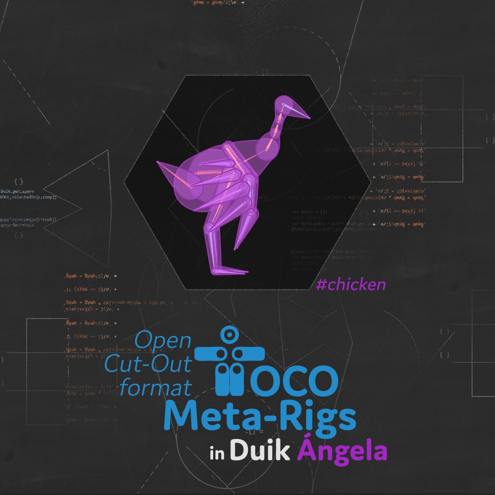
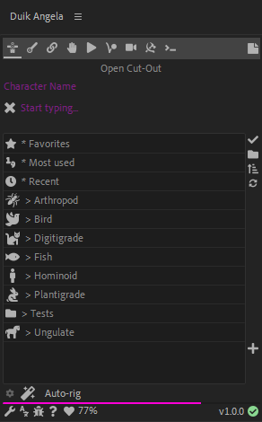
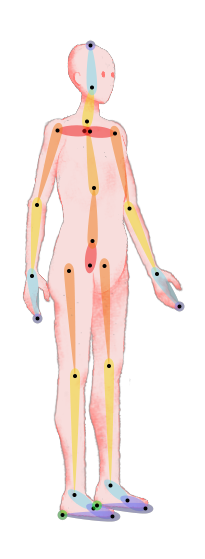
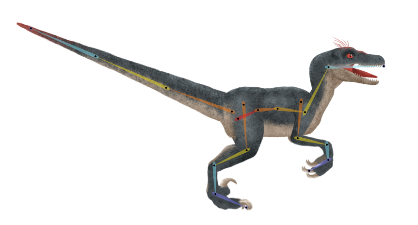
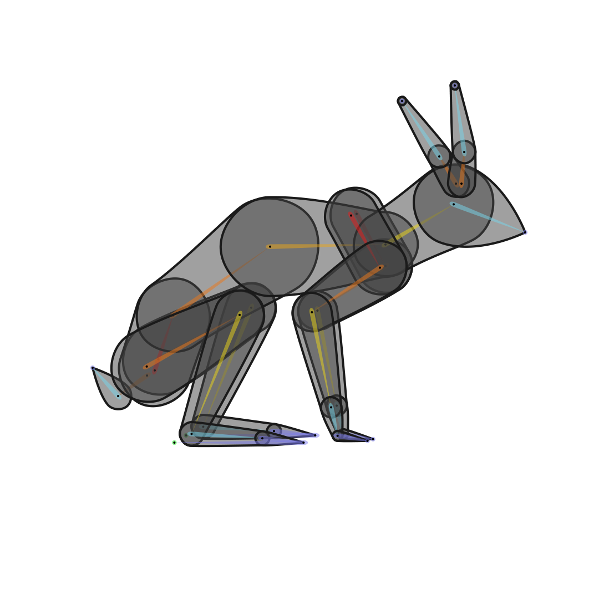
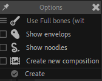

# {style="width:1em;"} OCO and Meta-rigs

*OCO* is the ***Open Cut-Out format***: it’s a format developped by RxLab., used to export, share, and import rigged characters dedicated to cut-out animation as it can be done in After Effects and many other software like Blender.

With the support of OCO, Duik now also includes a lot of Meta-rigs, predefined armatures you can use to rig an entire character in a few clicks, thanks to the almighty Duik [Auto-rig](../bones/autorig/index.md).

## The Meta-rig Library

The OCO Panel in Duik is a **library of meta-rigs**, to help you create armatures for all kind of animals in a single click.

These meta-rigs are sorted into categories, corresponding to the type of animals.

Each of these meta-rigs has been carefully crafted so that their limbs have realistic proportions and the joints have an optimal location for 2D cut-out animation. That means they can be used both for rigging existing characters or as a reference to design new characters.

As they follow the OCO standard, the Duik [Auto-rig](../bones/autorig/index.md) is able to rig the armatures created using these meta-rigs in a single click and provide all needed controllers for a very easy, though very detailed animation.

### Creating new armatures

To create an armature from an OCO meta-rig, you just have to find it in the library and double click the item or click the {style="width:1em;"} apply button.

You can filter categories and meta-rigs using the search field on top of the panel.

To automatically assign a given name to the new character, you can set its name in the character name field on top of the panel, this name will be used for the creation of the armature.

!!! note
    The created armatures are using [Duik Bones](../bones/index.md), and all of the bone options and features are available to further customize it[^1].

### Creation options

If you `[Shift] + [Click]` the {style="width:1em;"} apply button, you can set a few options for the creation of the bones.

- You can change the **type** of bones to be created:
    - *Full Bones* are bones with [envelops](../bones/envelops.md) and [noodles](../bones/noodles.md)[^1], if you plan to use all of these bone features.
    - *Light Bones* are simpler bones with better performance, but without envelops nor noodles or other advanced features.
- You can **show the bone envelops** by default. Use this if you're using the meta-rig as a reference to design a character for example.
- You can **show the bone noodles** by default. You can use this to use the meta-rig as a base for designing a simple vector character.
- Select the ***Create new composition*** option to create the new armature in its own dedicated composition.

### Extending the library

You can add your own custom OCO meta-rigs to the library, from any composition containing Duik Bones.

You can handle the content of the library with the buttons on the bottom right corner of the panel.

Duik will collect all information from the bones in the current composition and export it as a new OCO file stored in the library for future use.

When creating the meta-rig, you can include an icon which should be a small PNG file.

Set the approximative character height (from its lowest bone to the highest) so that information can be used when creating multiple characters in the same scene and automatically have them approximately at the right size. This height is in centimeters to be independant from the resolution.

### OCO Files

The library is actually just a folder structure containing OCO files, which is by default located in your `Documents` folder. You can quickly open this folder with the {style="width:1em;"} folder button, or set a new folder to be used as the library with `[Alt] + [Click]`. In this case you must select (or create) an new `OCO.config` file which will contain all your OCO settings, shared accross all applications using OCO and this same config file.

!!! tip
    You can share this library (just send the files) or even synchronize it accross multiple devices using any syncing service or application like [*Syncthing*](https://syncthing.net/)[^2], *Dropbox*, *OneDrive*, etc.

[^1]: See the following section entitled [*Bones and Auto-Rig*](../bones/index.md).

[^2]: Syncthing is a great free and open source continuous file synchronization program. Read more on [syncthing.net](https://syncthing.net/).