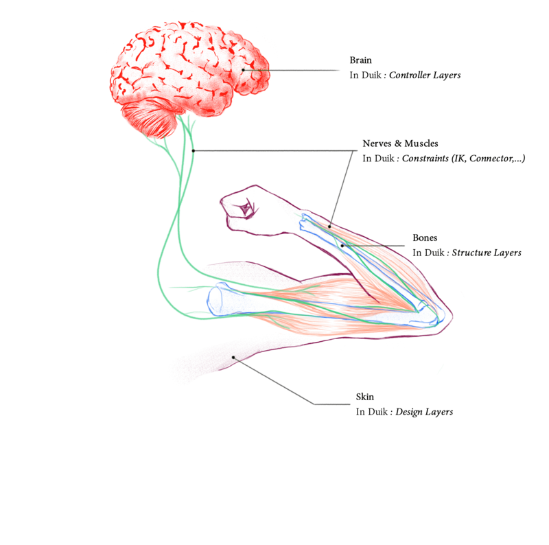

# The rigging process in Duik Ángela

To make the rigging process easier and more versatile in After Effects, Duik uses *Bones*, much like any 3D software.

The process can be summarized in just a few words:

1. **Create an armature**
    1. Create [bones](bones/index.md)
    2. Link artwork layers to the bones
2. **Create controls**
    1. [Auto-rig](bones/autorig/index.md)
    2. Tweak the [controllers](controllers/index.md) if you'd like
    2. Add other [constraints](constraints/index.md) if needed

For each of these steps, Duik helps you with a lot of automation, and the basic rig of a standard character should take no more than a few minutes.

Then, you're ready to animate:

1. **Prepare the animation**
    1. Add the rigged composition to your scene(s)
    2. [Extract the controllers](controllers/extract.md) to animate
2. **Automate some parts of the animation**
    1. Use Duik's [Procedural animation tools](automation/index.md) to animate more easily and quickly
    2. Use the [Animation panel](animation/index.md) to tweak your keyframes

## [{style="width:32px;"} Armatures and bones](bones/index.md)

  

***[Bones](bones/index.md)*** are layers you can add in your composition which will drive the animations, like the rig of a real puppet. The process is very simple: create or import your artwork in After Effects, add Bones and move them to the right spots (the joints of the limbs). Then you can rig those Bones and link the design layers to the corresponding Bone layers.

This way, the rig you create is independant from the design. This means it’s easier to adjust the design even after the rig has been made, or even to re-use the same rig with other designs. Also, this rigging process is easier to fix or change if you ever need to adjust it even when you’re already in the animation process.

  

## [{style="width:32px;"} Controllers](controllers/index.md)

Using the auto-rig, and a set of constraints, what you end with are ***[Controllers](controllers/index.md)*** to drive the animation. You animate the controllers, they drive the bones through the constraints, and voilà! Your character moves.

## [{style="width:32px;"} Constraints](constraints/index.md)

The interaction between the *Controllers* and the *Bones*, and between the *Bones* themselves, happens through some ***[Constraints](constraints/index.md)***. Some of them are the core tools of Duik since the first version, like IK which drive the bending of limbs, and the [*Pins*](constraints/pins.md) which are used to control any spatial properties like puppet pins or the emitter of a particle effect, or any Bézier value like shapes or masks.

There is also a whole set of constraints to automate even more movements and make the animator’s life very easier: it’s possible to animate parenting with the *[Parent Constraint](constraints/parent.md)*, or to constrain a layer to a Bézier path, to attach a layer to other layers using weights, etc.

## [{style="width:32px;"} Auto-rig](bones/autorig/index.md)

  

Let’s face it, most of the time you only need to rig standard animals, with legs, arms, spine, maybe a tail… All what differs are the hair, some props and cloth.

The ***[Auto-rig](bones/autorig/index.md)*** is a versatile tool to automate most of this process. It is able to recognize predefined bones created by Duik and rig them automatically. It handles all kinds of limbs and animals, even imaginary ones.

All you have to do is to create the Bones, the Auto-rig will do the rest, adding constraints and controllers for a fully rigged character. All that will be remaining are specific cases (hair, props), and facial rigging which is not automated ***yet***.

## [{style="width:32px;"} Procedural animation](automation/index.md)

As soon as your character is rigged, you can begin the animation, being helped by a lot of ***Automations***.
These ***[Automations](automation/index.md)*** are procedural animations and dynamics to quickly set up the most common animations and then focus on the characterization of your character. You can automate wiggles, springs, wheels, etc. with customizable and advanced controls for example to loop the effects, and access each and every detail quickly and easily.

The [***Kleaner***](automation/kleaner.md) helps you quickly and semia-automagically apply the most important animation principles: anticipation, spacing, follow-through and overlapping animation.