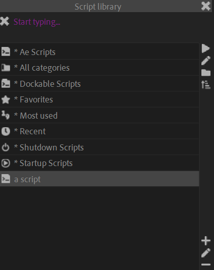

# {style="width:1em;"} Script Library

The Script Library is similar to other libraries in Duik, such as the [OCO meta-rig library](../../oco/index.md) or the [animation library](../../animation/anim-library.md) and provides a quick access to all your scripts.

You can use the field on the top of the panel to quickly search for scripts and navigate in the categories.

Some predefined categories are available by default, to list all available scripts in different locations on your system. These correspond to the default locations and scripts available with After Effects.

To run a script, `[double click]` it or select it and click the {style="width:1em;"} *Run* button.  
Dockable scripts (a.k.a. ScriptUI Panels) are launched as an After Effects dockable panel, but if you `[Alt] + [Click]` the *Run* button, Duik will try to launch their standard (not dockable) version. This may fail if the developer of the script didn't implement this feature.

You can also quickly open scripts for edition from the library, by clicking the {style="width:1em;"} *Edit* button when the script is selected. By default, the script is opened using the default system's editor corresponding to the file type of the script (usually `.jsx`). You can set a specific editor if you `[Shift] + [Click]` the button, or `[Alt] + [Click]` to open it in a simple editor included in the panel of Duik for [quick edition of small scripts](script-editor.md)&nbsp;[^editor].

[^editor]: *cf [General Tools](../index.md) / Scripts and Expressions / [Script Editor](script-editor.md)*.

Click the {style="width:1em;"} *Folder* button to open the folder containing the selected script.

## Editing the library

### {style="width:1em;"} Add

Click the {style="width:1em;"} *add* button to add a new category, or a new script in the current library category.

### {style="width:1em;"} Edit

Select a category and click the {style="width:1em;"} *edit* button to edit its name.

Select a script and click the {style="width:1em;"} *edit* button to add an icon (we recommend using a 16-pixel square PNG), change its name or category, or add it to your favorites.

### {style="width:1em;"} Remove

Select a category or a script and click the {style="width:1em;"} *remove* button to remove it. Scripts are just removed from the library, but they're not actually removed from disk.

